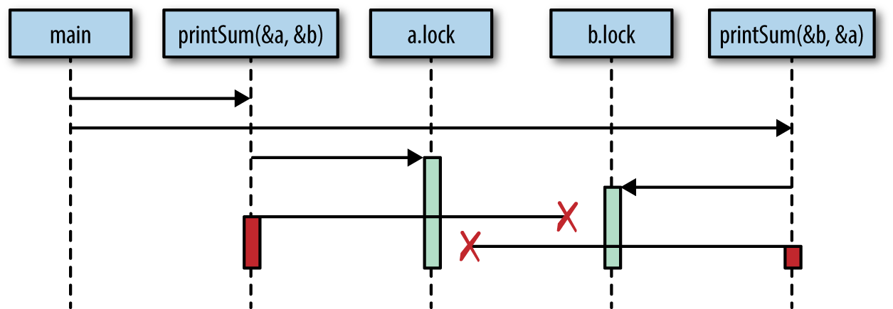
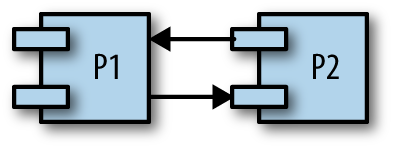

# Concurrency in Go

by Katherine Cox-Buday

# Chapter 1. An Introduction to Concurrency

* [Moore’s Law, Web Scale, and the Mess We’re In](#moores-law-web-scale-and-the-mess-were-in)
* [Why Is Concurrency Hard?](#why-is-concurrency-hard)
    * [Race Conditions](#race-conditions)
    * [Atomicity](#atomicity)
                * [Fun Fact](#fun-fact)
    * [Memory Access Synchronization](#memory-access-synchronization)
    * [Deadlocks, Livelocks, and Starvation](#deadlocks-livelocks-and-starvation)
        * [Deadlock](#deadlock)
                * [Irony](#irony)
        * [Livelock](#livelock)
        * [Starvation](#starvation)
                * [Finding a Balance](#finding-a-balance)
    * [Determining Concurrency Safety](#determining-concurrency-safety)
* [Simplicity in the Face of Complexity](#simplicity-in-the-face-of-complexity)


Concurrency is an interesting word because it means different things to
different people in our field. In addition to “concurrency,” you may have heard
the words, “asynchronous,”“parallel,” or “threaded” bandied about. Some people
take these words to mean the same thing, and other people very specifically
delineate between each of those words. If we’re to spend an entire book’s worth
of time discussing concurrency, it would be beneficial to first spend some time
discussing what we mean when we say “concurrency.”

We’ll spend some time on the philosophy of concurrency in [Chapter 2][2], but
for now let’s adopt a practical definition that will serve as the foundation of
our understanding.

[2]: ./ch02-modeling-your-code-CSP.md

When most people use the word “concurrent,” they’re usually referring to a
process that occurs simultaneously with one or more processes. It is also
usually implied that all of these processes are making progress at about the
same time. Under this definition, an easy way to think about this are people.
You are currently reading this sentence while others in the world are
simultaneously living their lives. They are existing *concurrently* to you.

Concurrency is a broad topic in computer science, and from this definition
spring all kinds of topics: theory, approaches to modeling concurrency,
correctness of logic, practical issues—even theoretical physics! We’ll touch on
some of the ancillary topics throughout the book, but we’ll mostly stick to the
practical issues that involve understanding concurrency within the context of
Go, specifically: how Go chooses to model concurrency, what issues arise from
this model, and how we can compose primitives within this model to solve
problems.

In this chapter, we’ll take a broad look at some of the reasons concurrency
became such an important topic in computer science, why concurrency is difficult
and warrants careful study, and—most importantly—the idea that despite these
challenges, Go can make programs clearer and faster by using its concurrency
primitives.

As with most paths toward understanding, we’ll begin with a bit of history.
Let’s first take a look at how concurrency became such an important topic.


# Moore’s Law, Web Scale, and the Mess We’re In

In 1965, Gordon Moore wrote a three-page paper that described both the 
consolidation of the electronics market toward integrated circuits, and the 
doubling of the number of components in an integrated circuit every year for at 
least a decade. In 1975, he revised this prediction to state that the number of 
components on an integrated circuit would double every two years. This 
prediction more or less held true until just recently—around 2012.

Several companies foresaw this slowdown in the rate Moore’s law predicted and 
began to investigate alternative ways to increase computing power. As the saying 
goes, necessity is the mother of innovation, and so it was in this way that 
multicore processors were born.

This looked like a clever way to solve the bounding problems of Moore’s law, but 
computer scientists soon found themselves facing down the limits of another law: 
Amdahl’s law, named after computer architect Gene Amdahl.

Amdahl’s law describes a way in which to model the potential performance gains 
from implementing the solution to a problem in a parallel manner. Simply put, it 
states that the gains are bounded by how much of the program must be written in 
a sequential manner.

For example, imagine you were writing a program that was largely GUI based: a 
user is presented with an interface, clicks on some buttons, and stuff happens. 
This type of program is bounded by one very large sequential portion of the 
pipeline: human interaction. No matter how many cores you make available to this 
program, it will always be bounded by how quickly the user can interact with the 
interface.

Now consider a different example, calculating digits of pi. Thanks to a class of 
algorithms called [spigot algorithms][3], this problem is called *embarrassingly 
parallel*, which—despite sounding made up—is a technical term which means that 
it can easily be divided into parallel tasks. In this case, significant gains 
can be made by making more cores available to your program, and your new problem 
becomes how to combine and store the results.

[3]: https://en.wikipedia.org/wiki/Spigot_algorithm

Amdahl’s law helps us understand the difference between these two problems, and 
can help us decide whether parallelization is the right way to address 
performance concerns in our system.

For problems that are embarrassingly parallel, it is recommended that you write 
your application so that it can *scale horizontally*. This means that you can 
take instances of your program, run it on more CPUs, or machines, and this will 
cause the runtime of the system to improve. Embarrassingly parallel problems fit 
this model so well because it’s very easy to structure your program in such a 
way that you can send chunks of a problem to different instances of your 
application.

Scaling horizontally became much easier in the early 2000s when a new paradigm 
began to take hold: *cloud computing*. Although there are indications that the 
phrase had been used as early as the 1970s, the early 2000s are when the idea 
really took root in the zeitgeist. Cloud computing implied a new kind of scale 
and approach to application deployments and horizontal scaling. Instead of 
machines that you carefully curated, installed software on, and maintained, 
cloud computing implied access to vast pools of resources that were provisioned 
into machines for workloads on-demand. Machines became something that were 
almost ephemeral, and provisioned with characteristics specifically suited to 
the programs they would run.  Usually (but not always) these resource pools were 
hosted in data centers owned by other companies.

This change encouraged a new kind of thinking. Suddenly, developers had 
relatively cheap access to vast amounts of computing power that they could use 
to solve large problems. Solutions could now trivially span many machines and 
even global regions. Cloud computing made possible a whole new set of solutions 
to problems that were previously only solvable by tech giants.

But cloud computing also presented many new challenges. Provisioning these 
resources, communicating between machine instances, and aggregating and storing 
the results all became problems to solve. But among the most difficult was 
figuring out how to model code concurrently. The fact that pieces of your 
solution could be running on disparate machines exacerbated some of the issues 
commonly faced when modeling a problem concurrently. Successfully solving these 
issues soon led to a new type of brand for software, *web scale*.

If software was web scale, among other things, you could expect that it would be 
embarrassingly parallel; that is, web scale software is usually expected to be 
able to handle hundreds of thousands (or more) of simultaneous workloads by 
adding more instances of the application. This enabled all kinds of properties 
like rolling upgrades, elastic horizontally scalable architecture, and 
geographic distribution. It also introduced new levels of complexity both in 
comprehension and fault tolerance.

And so it is in this world of multiple cores, cloud computing, web scale, and 
problems that may or may not be parallelizable that we find the modern 
developer, maybe a bit overwhelmed. The proverbial buck has been passed to us, 
and we are expected to rise to the challenge of solving problems within the 
confines of the hardware we’ve been handed.  In 2005, Herb Sutter authored an 
article for *Dr. Dobb’s*, titled, [“The free lunch is over: A fundamental turn 
toward concurrency in software”][4]. The title is apt, and the article 
prescient.  Toward the end, Sutter states,“We desperately need a higher-level 
programming model for concurrency than languages offer today.”

[4]: http://www.gotw.ca/publications/concurrency-ddj.htm

To know why Sutter used such strong language, we have to look at why concurrency 
is so hard to get right.


# Why Is Concurrency Hard?

Concurrent code is notoriously difficult to get right. It usually takes a few 
iterations to get it working as expected, and even then it’s not uncommon for 
bugs to exist in code for years before some change in timing (heavier disk 
utilization, more users logged into the system, etc.) causes a previously 
undiscovered bug to rear its head. Indeed, for this very book, I’ve gotten as 
many eyes as possbile on the code to try and mitigate this.

Fortunately *everyone* runs into the same issues when working with concurrent 
code. Because of this, computer scientists have been able to label the common 
issues, which allows us to discuss how they arise, why, and how to solve them.

So let’s get started. Following are some of the most common issues that make 
working with concurrent code both frustrating and interesting.


## Race Conditions

A race condition occurs when two or more operations must execute in the correct 
order, but the program has not been written so that this order is guaranteed to 
be maintained.

Most of the time, this shows up in what’s called a *data race*, where one 
concurrent operation attempts to read a variable while at some undetermined time 
another concurrent operation is attempting to write to the same variable.

Here’s a basic example:

```go
1  var data int
2  go func() {  // ①  
3      data++
4  }()
5  if data == 0 {
6      fmt.Printf("the value is %v.\n", data)
7  }
```

  - ①  In Go, you can use the `go` keyword to run a function concurrently.
    Doing so creates what’s called a *goroutine*. We’ll discuss this in detail 
    in the section, [“Goroutines”][5]

[5]: ./ch03-gos-concurrency-building-blocks.md

Here, lines 3 and 5 are both trying to access the variable data, but there is no 
guarantee what order this might happen in. There are three possible outcomes to 
running this code:

  - Nothing is printed. In this case, line 3 was executed before line 5.

  - “the value is 0” is printed. In this case, lines 5 and 6 were executed 
    before line 3.

  - “the value is 1” is printed. In this case, line 5 was executed before line 
    3, but line 3 was executed before line 6.

As you can see, just a few lines of incorrect code can introduce tremendous 
variability into your program.

Most of the time, data races are introduced because the developers are thinking 
about the problem sequentially. They assume that because a line of code falls 
before another that it will run first. They assume the goroutine above will be 
scheduled and execute before the `data` variable is read in the `if` statement.

When writing concurrent code, you have to meticulously iterate through the 
possible scenarios. Unless you’re utilizing some of the techniques we’ll cover 
later in the book, you have no guarantees that your code will run in the order 
it’s listed in the sourcecode. I sometimes find it helpful to imagine a large 
period of time passing between operations.  Imagine an hour passes between the 
time when the goroutine is invoked, and when it is run. How would the rest of 
the program behave? What if it took an hour between the goroutine executing 
successfully and the program reaching the `if` statement? Thinking in this 
manner helps me because to a computer, the scale may be different, but the 
relative time differentials are more or less the same.

Indeed, some developers fall into the trap of sprinkling sleeps throughout their 
code exactly because it seems to solve their concurrency problems. Let’s try 
that in the preceding program:

```go
1  var data int
2  go func() { data++ }()
3  time.Sleep(1*time.Second) // This is bad!
4  if data == 0 {
5      fmt.Printf("the value is %v.\n" data)
6  }
```

Have we solved our data race? No. In fact, it’s still possible for all three 
outcomes to arise from this program, just increasingly *unlikely*.  The longer 
we sleep in between invoking our goroutine and checking the value of data, the 
closer our program gets to achieving correctness—but this probability 
asymptotically approaches logical correctness; it will never be logically 
correct.

In addition to this, we’ve now introduced an inefficiency into our algorithm. We 
now have to sleep for one second to make it more likely we won’t see our data 
race. If we utilized the correct tools, we might not have to wait at all, or the 
wait could be only a microsecond.

The takeaway here is that you should always target logical correctness.
Introducing sleeps into your code can be a handy way to debug concurrent 
programs, but they are not a solution.

Race conditions are one of the most insidious types of concurrency bugs because 
they may not show up until years after the code has been placed into production. 
They are usually precipitated by a change in the environment the code is 
executing in, or an unprecedented occurrence. In these cases, the code seems to 
be behaving correctly, but in reality, there’s just a very high chance that the 
operations will be executed in order. Sooner or later, the program will have an 
unintended consequence.


## Atomicity

When something is considered atomic, or to have the property of atomicity, this 
means that within the context that it is operating, it is indivisible, or 
uninterruptible.

So what does that really mean, and why is this important to know when working 
with concurrent code?

The first thing that’s very important is the word “context.” Something may be 
atomic in one context, but not another. Operations that are atomic within the 
context of your process may not be atomic in the context of the operating 
system; operations that are atomic within the context of the operating system 
may not be atomic within the context of your machine; and operations that are 
atomic within the context of your machine may not be atomic within the context 
of your application. In other words, the atomicity of an operation can change 
depending on the currently defined scope. This fact can work both for and 
against you!

When thinking about atomicity, very often the first thing you need to do is to 
define the context, or scope, the operation will be considered to be atomic in. 
Everything follows from this.


##### Fun Fact

In 2006, the gaming company Blizzard successfully sued MDY Industries for 
$6,000,000 USD for making a program called “Glider,” which would automatically 
play their game, World of Warcraft, without user intervention. These types of 
programs are commonly referred to as “bots” (short for robots).

At the time, World of Warcraft had an anti-cheating program called“Warden,” 
which would run anytime you played the game. Among other things, Warden would 
scan the memory of the host machine and run a heuristic to look for programs 
that appeared to be used for cheating.

Glider successfully avoided this check by taking advantage of the concept of 
atomic context. Warden considered scanning the memory on the machine as an 
atomic operation, but Glider utilized hardware interrupts to hide itself before 
this scanning started! Warden’s scan of memory was atomic within the context of 
the process, but not within the context of the operating system.

Now let’s look at the terms “indivisible” and “uninterruptible.” These terms 
mean that within the context you’ve defined, something that is atomic will 
happen in its entirety without anything happening in that context 
simultaneously. That’s still a mouthful, so let’s look at an example:

```
i++
```

This is about as simple an example as anyone can contrive, and yet it easily 
demonstrates the concept of atomicity. It may *look* atomic, but a brief 
analysis reveals several operations:

  - Retrieve the value of `i`.

  - Increment the value of `i`.

  - Store the value of `i`.

While each of these operations alone is atomic, the combination of the three may 
not be, depending on your context. This reveals an interesting property of 
atomic operations: combining them does not necessarily produce a larger atomic 
operation. Making the operation atomic is dependent on which context you’d like 
it to be atomic within. If your context is a program with no concurrent 
processes, then this code is atomic within that context. If your context is a 
goroutine that doesn’t expose `i` to other goroutines, then this code is atomic.

So why do we care? Atomicity is important because if something is atomic, 
implicitly it is safe within concurrent contexts. This allows us to compose 
logically correct programs, and—as we’ll later see—can even serve as a way to 
optimize concurrent programs.

Most statements are not atomic, let alone functions, methods, and programs. If 
atomicity is the key to composing logically correct programs, and most 
statements aren’t atomic, how do we reconcile these two statements? We’ll go 
into more depth later, but in short we can force atomicity by employing various 
techniques. The art then becomes determining which areas of your code need to be 
atomic, and at what level of granularity. We discuss some of these challenges in 
the next section.


## Memory Access Synchronization

Let’s say we have a data race: two concurrent processes are attempting to access 
the same area of memory, and the way they are accessing the memory is not 
atomic. Our previous example of a simple data race will do nicely with a few 
modifications:

```go
var data int
go func() { data++}()
if data == 0 {
    fmt.Println("the value is 0.")
} else {
    fmt.Printf("the value is %v.\n", data)
}
```

We’ve added an `else` clause here so that regardless of the value of `data` 
we’ll always get some output. Remember that as it is written, there is a data 
race and the output of the program will be completely nondeterministic.

In fact, there’s a name for a section of your program that needs exclusive 
access to a shared resource. This is called a *critical section*. In this 
example, we have three critical sections:

  - Our goroutine, which is incrementing the `data` variables.

  - Our `if` statement, which checks whether the value of `data` is 0.

  - Our `fmt.Printf` statement, which retrieves the value of `data` for output.

There are various ways to guard your program’s critical sections, and Go has 
some better ideas on how to deal with this, but one way to solve this problem is 
to synchronize access to the memory between your critical sections. Let’s see 
what that looks like.

The following code is not idiomatic Go (and I don’t suggest you attempt
to solve your data race problems like this), but it very simply
demonstrates memory access synchronization. If any of the types,
functions, or methods in this example are foreign to you, that’s OK.
Focus on the concept of synchronizing access to the memory by following
the callouts.

```go
var memoryAccess sync.Mutex // ① 
var value int
go func() {
    memoryAccess.Lock()     // ② 
    value++
    memoryAccess.Unlock()   // ③  
}()

memoryAccess.Lock()         // ④ 
if value == 0 {
    fmt.Printf("the value is %v.\n", value)
} else {
    fmt.Printf("the value is %v.\n", value)
}
memoryAccess.Unlock()       // ⑤ 
```

  - ①  Here we add a variable that will allow our code to synchronize access to 
    the `data` variable’s memory. We’ll go over the `sync.Mutex` type in detail 
    in [“The sync Package”][6].

  - ②  Here we declare that until we declare otherwise, our goroutine should 
    have exclusive access to this memory.

  - ③  Here we declare that the goroutine is done with this memory.

  - ④  Here we once again declare that the following conditional statements 
    should have exclusive access to the `data` variable’s memory.

  - ⑤  Here we declare we’re once again done with this memory.

[6]: ./ch03-gos-concurrency-building-blocks.md#sync_package
[7]: ./ch04-concurrency-in-go.md#confinement

In this example we’ve created a convention for developers to follow.  Anytime 
developers want to access the `data` variable’s memory, they must first call 
`Lock`, and when they’re finished they must call `Unlock`. Code between those 
two statements can then assume it has exclusive access to `data`; we have 
successfully *synchronized* access to the memory. Also note that if developers 
don’t follow this convention, we have no guarantee of exclusive access! We’ll 
return to this idea in the section [“Confinement”][7].

You may have noticed that while we have solved our data race, we haven’t 
actually solved our race condition! The order of operations in this program is 
still nondeterministic; we’ve just narrowed the scope of the nondeterminism a 
bit. In this example, either the goroutine will execute first, or both our `if` 
and `else` blocks will. We still don’t know which will occur first in any given 
execution of this program. Later, we’ll explore the tools to solve this kind of 
issue properly.

On its face this seems pretty simple: if you find you have critical sections, 
add points to synchronize access to the memory! Easy, right?  Well…sort of.

It is true that you can solve some problems by synchronizing access to the 
memory, but as we just saw, it doesn’t automatically solve data races or logical 
correctness. Further, it can also create maintenance and performance problems.

Note that earlier we mentioned that we had created a *convention* for declaring 
we needed exclusive access to some memory. Conventions are great, but they’re 
also easy to ignore—especially in software engineering where the demands of 
business sometimes outweigh prudence.  By synchronizing access to the memory in 
this manner, you are counting on all other developers to follow the same 
convention now and into the future. That’s a pretty tall order. Thankfully, 
later in this book we’ll also look at some ways we can help our colleagues be 
more successful.

Synchronizing access to the memory in this manner also has performance 
ramifactions. We’ll save the details for later when we examine the `sync` 
package in the section [“The sync Package”][6], but the calls to `Lock` you see 
can make our program *slow*. Every time we perform one of these operations, our 
program pauses for a period of time. This brings up two questions:

  - Are my critical sections entered and exited repeatedly?

  - What size should my critical sections be?

Answering these two questions in the context of your program is an art, and this 
adds to the difficulty in synchronizing access to the memory.

Synchronizing access to the memory also shares some problems with other 
techniques of modeling concurrent problems, and we’ll discuss those in the next 
section.


## Deadlocks, Livelocks, and Starvation

The previous sections have all been about discussing program correctness
in that if these issues are managed correctly, your program will never
give an incorrect answer. Unfortunately, even if you successfully handle
these classes of issues, there is another class of issues to contend
with: deadlocks, livelocks, and starvation. These issues all concern
ensuring your program has something useful to do at all times. If not
handled properly, your program could enter a state in which it will stop
functioning altogether.

### Deadlock

A deadlocked program is one in which all concurrent processes are waiting on one 
another. In this state, the program will never recover without outside 
intervention.

If that sounds grim, it’s because it is! The Go runtime attempts to do
its part and will detect some deadlocks (all goroutines must be blocked,
or “asleep”<sup>[1](ch01.html#idm140183163626208)</sup>), but this
doesn’t do much to help you prevent deadlocks.

To help solidify what a deadlock is, let’s first look at an example.  Again, 
it’s safe to ignore any types, functions, methods, or packages you don’t know 
and just follow the code callouts.

```go
type value struct {
    mu    sync.Mutex
    value int
}

var wg sync.WaitGroup
printSum := func(v1, v2 *value) {
    defer wg.Done()
    v1.mu.Lock()            // ① 
    defer v1.mu.Unlock()    // ② 

    time.Sleep(2*time.Second) // ③ 
    v2.mu.Lock()    
    defer v2.mu.Unlock()    

    fmt.Printf("sum=%v\n", v1.value + v2.value)
}

var a, b value
wg.Add(2)
go printSum(&a, &b)
go printSum(&b, &a)
wg.Wait()
```

  - ①  Here we attempt to enter the critical section for the incoming value.

  - ②  Here we use the `defer` statement to exit the critical section before 
    `printSum` returns.

  - ③  Here we sleep for a period of time to simulate work (and trigger a 
    deadlock).

If you were to try and run this code, you’d probably see:

    fatal error: all goroutines are asleep - deadlock!

Why? If you look carefully, you’ll see a timing issue in this code.
Following is a graphical representation of what’s going on. The boxes
represent functions, the horizontal lines calls to these functions, and
the vertical bars lifetimes of the function at the head of the graphic
([Figure
1-1](#demo_of_a_timing_issue_giving)).



Essentially, we have created two gears that cannot turn together: our first call 
to `printSum` locks `a` and then attempts to lock `b`, but in the meantime our 
second call to `printSum` has locked `b` and has attempted to lock `a`. Both 
goroutines wait infinitely on each other.


##### Irony

To keep this example simple, I use a `time.Sleep` to trigger the deadlock. 
However, this introduces a race condition! Can you find it?

A logically “perfect” deadlock would require correct synchronization.  
<sup>[2](#idm140183163399616)</sup>

It seems pretty obvious why this deadlock is occurring when we lay it out 
graphically like that, but we would benefit from a more rigorous definition. It 
turns out there are a few conditions that must be present for deadlocks to 
arise, and in 1971, Edgar Coffman enumerated these conditions in a [paper][8]. 
The conditions are now known as the *Coffman Conditions* and are the basis for 
techniques that help detect, prevent, and correct deadlocks.

[8]: http://bit.ly/CoffmanDeadlocks

The Coffman Conditions are as follows:

  - Mutual Exclusion  
    A concurrent process holds exclusive rights to a resource at any one time.

  - Wait For Condition  
    A concurrent process must simultaneously hold a resource and be waiting for 
    an additional resource.

  - No Preemption  
    A resource held by a concurrent process can only be released by that 
    process, so it fulfills this condition.

  - Circular Wait  
    A concurrent process (P1) must be waiting on a chain of other concurrent 
    processes (P2), which are in turn waiting on it (P1), so it fulfills this 
    final condition too.



Let’s examine our contrived program and determine if it meets all four 
conditions:

1.  The `printSum` function does require exclusive rights to both `a` and `b`, 
    so it fulfills this condition.

2.  Because `printSum` holds either `a` or `b` and is waiting on the other, it 
    fulfills this condition.

3.  We haven’t given any way for our goroutines to be preempted.

4.  Our first invocation of `printSum` is waiting on our second invocation, and 
    vice versa.

Yep, we definitely have a deadlock on our hands.

These laws allow us to *prevent* deadlocks too. If we ensure that at least one 
of these conditions is not true, we can prevent deadlocks from occurring. 
Unfortunately, in practice these conditions can be hard to reason about, and 
therefore difficult to prevent. The web is strewn with questions from developers 
like you and me wondering why a snippet of code is deadlocking. Usually it’s 
pretty obvious once someone points it out, but often it requires another set of 
eyes. We’ll talk about why this is in the section [“Determining Concurrency 
Safety”](#determining-concurrency-safety).


### Livelock

Livelocks are programs that are actively performing concurrent operations, but 
these operations do nothing to move the state of the program forward.

Have you ever been in a hallway walking toward another person? She moves to one 
side to let you pass, but you’ve just done the same. So you move to the other 
side, but she’s also done the same. Imagine this going on forever, and you 
understand livelocks.

Let’s actually write some code that will help demonstrate this scenario.  First, 
we’ll set up a few helper functions that will simplify the example. In order to 
have a working example, the code here utilizes several topics we haven’t yet 
covered. I don’t advise attempting to understand it in any detail until you have 
a firm grasp on the `sync` package. Instead, I recommend following the code 
callouts to understand the highlights, and then turning your attention to the 
second code block, which contains the heart of the example.

```go
cadence := sync.NewCond(&sync.Mutex{})
go func() {
    for range time.Tick(1*time.Millisecond) {
        cadence.Broadcast()
    }
}()

takeStep := func() {
    cadence.L.Lock()
    cadence.Wait()
    cadence.L.Unlock()
}

tryDir := func(dirName string, dir *int32, out *bytes.Buffer) bool { // ① 
    fmt.Fprintf(out, " %v", dirName)
    atomic.AddInt32(dir, 1) // ② 
    takeStep() // ③ 
    if atomic.LoadInt32(dir) == 1 {
        fmt.Fprint(out, ". Success!")
        return true
    }
    takeStep()
    atomic.AddInt32(dir, -1) // ④ 
    return false
}

var left, right int32
tryLeft := func(out *bytes.Buffer) bool { return tryDir("left", &left, out) }
tryRight := func(out *bytes.Buffer) bool { return tryDir("right", &right, out) }
```

[9]: ./ch03-gos-concurrency-building-blocks.md#gos_concurrency_building_blocks

  - ①  `tryDir` allows a person to attempt to move in a direction and returns 
    whether or not they were successful. Each direction is represented as a 
    count of the number of people trying to move in that direction, `dir`.

  - ②  First, we declare our intention to move in a direction by incrementing 
    that direction by one. We’ll discuss the `atomic` package in detail in 
    [Chapter 3][9]. For now, all you need to know is that this package’s 
    operations are atomic.

  - ③  For the example to demonstrate a livelock, each person must move at the 
    same rate of speed, or cadence. `takeStep` simulates a constant cadence 
    between all parties.

  - ④  Here the person realizes they cannot go in this direction and gives up. 
    We indicate this by decrementing that direction by one.

```go
    walk := func(walking *sync.WaitGroup, name string) {
        var out bytes.Buffer
        defer func() { fmt.Println(out.String()) }()
        defer walking.Done()
        fmt.Fprintf(&out, "%v is trying to scoot:", name)
        for i := 0; i < 5; i++ { 
            if tryLeft(&out) || tryRight(&out) { 
                return
            }
        }
        fmt.Fprintf(&out, "\n%v tosses her hands up in exasperation!", name)
    }
    
    var peopleInHallway sync.WaitGroup 
    peopleInHallway.Add(2)
    go walk(&peopleInHallway, "Alice")
    go walk(&peopleInHallway, "Barbara")
    peopleInHallway.Wait()
```

  - [](#co_an_introduction_to_concurrency_CO5-1)  
    I placed an artificial limit on the number of attempts so that this
    program would end. In a program that has a livelock, there may be no
    such limit, which is why it’s a
    problem\!

  - [](#co_an_introduction_to_concurrency_CO5-2)  
    First, the person will attempt to step left, and if that fails, they
    will attempt to step
    right.

  - [](#co_an_introduction_to_concurrency_CO5-3)  
    This variable provides a way for the program to wait until both
    people are either able to pass one another, or give up.

This produces the following
    output:

    Alice is trying to scoot: left right left right left right left right left right
    Alice tosses her hands up in exasperation!
    Barbara is trying to scoot: left right left right left right left right
    left right
    Barbara tosses her hands up in exasperation!

You can see that Alice and Barbara continue getting in each other’s way
before finally giving up.

This example demonstrates a very common reason livelocks are written: two or 
more concurrent processes attempting to prevent a deadlock without coordination. 
If the people in the hallway had agreed with one another that only one person 
would move, there would be no livelock: one person would stand still, the other 
would move to the other side, and they’d continue walking.

In my opinion, livelocks are more difficult to spot than deadlocks simply 
because it can appear as if the program is doing work. If a livelocked program 
were running on your machine and you took a look at the CPU utilization to 
determine if it was doing anything, you might think it was. Depending on the 
livelock, it might even be emitting other signals that would make you think it 
was doing work. And yet all the while, your program would be playing an eternal 
game of hallway-shuffle.

Livelocks are a subset of a larger set of problems called *starvation*.  We’ll 
look at that next.


### Starvation

Starvation is any situation where a concurrent process cannot get all the 
resources it needs to perform work.

When we discussed livelocks, the resource each goroutine was starved of was a 
shared lock. Livelocks warrant discussion separate from starvation because in a 
livelock, all the concurrent processes are starved equally, and *no* work is 
accomplished. More broadly, starvation usually implies that there are one or 
more greedy concurrent process that are unfairly preventing one or more 
concurrent processes from accomplishing work as efficiently as possible, or 
maybe at all.

Here’s an example of a program with a greedy goroutine and a polite goroutine:

```go
var wg sync.WaitGroup
var sharedLock sync.Mutex
const runtime = 1*time.Second

greedyWorker := func() {
    defer wg.Done()

    var count int
    for begin := time.Now(); time.Since(begin) <= runtime; {
        sharedLock.Lock()
        time.Sleep(3*time.Nanosecond)
        sharedLock.Unlock()
        count++
    }

    fmt.Printf("Greedy worker was able to execute %v work loops\n", count)
}

politeWorker := func() {
    defer wg.Done()

    var count int
    for begin := time.Now(); time.Since(begin) <= runtime; {
        sharedLock.Lock()
        time.Sleep(1*time.Nanosecond)
        sharedLock.Unlock()

        sharedLock.Lock()
        time.Sleep(1*time.Nanosecond)
        sharedLock.Unlock()

        sharedLock.Lock()
        time.Sleep(1*time.Nanosecond)
        sharedLock.Unlock()

        count++
    }

    fmt.Printf("Polite worker was able to execute %v work loops.\n", count)
}

wg.Add(2)
go greedyWorker()
go politeWorker()

wg.Wait()
```

This produces:

    Polite worker was able to execute 289777 work loops.
    Greedy worker was able to execute 471287 work loops

The greedy worker greedily holds onto the shared lock for the entirety of its 
work loop, whereas the polite worker attempts to only lock when it needs to. 
Both workers do the same amount of simulated work (sleeping for three 
nanoseconds), but as you can see in the same amount of time, the greedy worker 
got almost *twice* the amount of work done!

If we assume both workers have the same-sized critical section, rather than 
concluding that the greedy worker’s algorithm is more efficient (or that the 
calls to `Lock` and `Unlock` are slow—they aren’t), we instead conclude that the 
greedy worker has unnecessarily expanded its hold on the shared lock beyond its 
critical section and is preventing (via starvation) the polite worker’s 
goroutine from performing work efficiently.

Note our technique here for identifying the starvation: a metric.  Starvation 
makes for a good argument for recording and sampling metrics.  One of the ways 
you can detect and solve starvation is by logging when work is accomplished, and 
then determining if your rate of work is as high as you expect it.


##### Finding a Balance

It is worth mentioning that the previous code example can also serve as an 
example of the performance ramifications of memory access synchronization. 
Because synchronizing access to the memory is expensive, it might be 
advantageous to broaden our lock beyond our critical sections. On the other 
hand, by doing so—as we saw—we run the risk of starving other concurrent 
processes.

If you utilize memory access synchronization, you’ll have to find a balance 
between preferring coarse-grained synchronization for performance, and fine-
grained synchronization for fairness. When it comes time to performance tune 
your application, to start with, I highly recommend you constrain memory access 
synchronization only to critical sections; if the synchronization becomes a 
performance problem, you can always broaden the scope. It’s much harder to go 
the other way.

So starvation can cause your program to behave inefficiently or incorrectly. The 
prior example demonstrates an inefficiency, but if you have a concurrent process 
that is so greedy as to *completely* prevent another concurrent process from 
accomplishing work, you have a larger problem on your hands.

We should also consider the case where the starvation is coming from outside the 
Go process. Keep in mind that starvation can also apply to CPU, memory, file 
handles, database connections: any resource that must be shared is a candidate 
for starvation.


## Determining Concurrency Safety

Finally, we come to the most difficult aspect of developing concurrent code, the 
thing that underlies all the other problems: people. Behind every line of code 
is at least one person.

As we’ve discovered, concurrent code is difficult for myriad reasons. If you’re 
a developer and you’re trying to wrangle all of these problems as you introduce 
new functionality, or fix bugs in your program, it can be really difficult to 
determine the right thing to do.

If you’re starting with a blank slate and need to build up a sensible way to 
model your problem space and concurrency is involved, it can be difficult to 
find the right level of abstraction. How do you expose the concurrency to 
callers? What techniques do you use to create a solution that is both easy to 
use and modify? What is the right *level* of concurrency for this problem? 
Although there are ways to think about these problems in structured ways, it 
remains an art.

As a developer interfacing with *existing* code, it’s not always obvious what 
code is utilizing concurrency, and how to utilize the code safely.  Take this 
function signature:

```go
// CalculatePi calculates digits of Pi between the begin and end
// place.
func CalculatePi(begin, end int64, pi *Pi)
```

Calculating pi with a large precision is something that is best done 
concurrently, but this example raises a lot of questions:

  - How do I do so with this function?

  - Am I responsible for instantiating multiple concurrent invocations of this 
    function?

  - It looks like all instances of the function are going to be operating 
    directly on the instance of `Pi` whose address I pass in; am I responsible 
    for synchronizing access to that memory, or does the `Pi` type handle this 
    for me?

One function raises all these questions. Imagine a program of any moderate size, 
and you can begin to understand the complexities concurrency can pose.

Comments can work wonders here. What if the `CalculatePi` function were instead 
written like this:

```go
// CalculatePi calculates digits of Pi between the begin and end
// place.
//
// Internally, CalculatePi will create FLOOR((end-begin)/2) concurrent
// processes which recursively call CalculatePi. Synchronization of
// writes to pi are handled internally by the Pi struct.
func CalculatePi(begin, end int64, pi *Pi)
```

We now understand that we can call the function plainly and not worry about 
concurrency or synchronization. Importantly, the comment covers these aspects:

  - Who is responsible for the concurrency?

  - How is the problem space mapped onto concurrency primitives?

  - Who is responsible for the synchronization?

When exposing functions, methods, and variables in problem spaces that involve 
concurrency, do your colleagues and future self a favor: err on the side of 
verbose comments, and try and cover these three aspects.

Also consider that perhaps the ambiguity in this function suggests that we’ve 
modeled it wrong. Maybe we should instead take a functional approach and ensure 
our function has no side effects:

```go
func CalculatePi(begin, end int64) []uint
```

The signature of this function alone removes any questions of synchronization, 
but still leaves the question of whether concurrency is used. We can modify the 
signature again to throw out another signal as to what is happening:

```go
func CalculatePi(begin, end int64) <-chan uint
```

Here we see the first usage of what’s called a *channel*. For reasons we’ll 
explore later in the section [“Channels”][10], this suggests that `CalculatePi` 
will at least have one goroutine and that we shouldn’t bother with creating our 
own.

[10]: ./ch03-gos-concurrency-building-blocks.md#channels

These modifications then have performance ramifications that have to be taken 
into consideration, and we’re back to the problem of balancing clarity with 
performance. Clarity is important because we want to make it as likely as 
possible that people working with this code in the future will do the right 
thing, and performance is important for obvious reasons. The two aren’t mutually 
exclusive, but they are difficult to mix.

Now consider these difficulties in communication and try and scale them up to 
team-sized projects.

Wow, this is a problem.

The good news is that Go has made progress in making these types of problems 
easier to solve. The language itself favors readability and simplicity. The way 
it encourages modeling your concurrent code encourages correctness, 
composability, and scalability.  In fact, the way Go handles concurrency can 
actually help express problem domains more clearly\! Let’s take a look at why 
this is the case.


# Simplicity in the Face of Complexity

So far, I’ve painted a pretty grim picture. Concurrency is certainly a difficult 
area in computer science, but I want to leave you with hope: these problems 
aren’t intractable, and with Go’s concurrency primitives, you can more safely 
and clearly express your concurrent algorithms. The runtime and communication 
difficulties we’ve discussed are by no means solved by Go, but they have been 
made significantly easier. In the next chapter, we’ll discover the root of how 
this progress has been accomplished. Here, let’s spend a little time exploring 
the idea that Go’s concurrency primitives can actually make it easier to model 
problem domains and express algorithms more clearly.

Go’s runtime does most of the heavy lifting and provides the foundation for most 
of Go’s concurrency niceties. We’ll save the discussion of how it all works for 
[Chapter 6][11], but here we’ll discuss how these things make your life easier.

[11]: ./ch06-goroutines-and-go-runtime.md#goroutines_and_the_go_runtime

Let’s first discuss Go’s concurrent, low-latency, garbage collector. There is 
often debate among developers as to whether garbage collectors are a good thing 
to have in a language. Detractors suggest that garbage collectors prevent work 
in any problem domain that requires real-time performance or a deterministic 
performance profile—that pausing all activity in a program to clean up garbage 
simply isn’t acceptable. While there is some merit to this, the excellent work 
that has been done on Go’s garbage collector has dramatically reduced the 
audience that needs to concern themselves with the minutia of how Go’s garbage 
collection works. As of Go 1.8, garbage collection pauses are generally between 
10 and 100 microseconds!

How does this help you? Memory management can be another difficult problem 
domain in computer science, and when combined with concurrency, it can become 
extraordinarily difficult to write correct code. If you’re in the majority of 
developers who don’t need to worry about pauses as small as 10 microseconds, Go 
has made it much easier to use concurrency in your program by not forcing you to 
manage memory, let alone across concurrent processes.

Go’s runtime also automatically handles multiplexing concurrent operations onto 
operating system threads. That’s a mouthful, and we’ll see exactly what that 
means in the section on [“Goroutines”][12]. For the purposes of understanding 
how this helps you, all you need to know is that it allows you to directly map 
concurrent problems into concurrent constructs instead of dealing with the 
minutia of starting and managing threads, and mapping logic evenly across 
available threads.

[12]: ./ch03-gos-concurrency-building-blocks.md#goroutines

For example, say you write a web server, and you’d like every connection 
accepted to be handled concurrently with every other connection.  In some 
languages, before your web server begins accepting connections, you’d likely 
have to create a collection of threads, commonly called a *thread pool*, and 
then map incoming connections onto threads. Then, within each thread you’ve 
created, you’d need to loop over all the connections on that thread to ensure 
they were all receiving some CPU time. In addition, you’d have to write your 
connection-handling logic to be pausable so that it shares fairly with the other 
connections.

Whew\! In contrast, in Go you would write a function and then prepend its 
invocation with the `go` keyword. The runtime handles everything else we 
discussed automatically\! When you’re going through the process of designing 
your program, under which model do you think you’re more likely to reach for 
concurrency? Which do you think is more likely to turn out correct?

Go’s concurrency primitives also make composing larger problems easier.  As 
we’ll see in the section [“Channels”][13], Go’s *channel* primitive provides a 
composable, concurrent-safe way to communicate between concurrent processes.

[13]: ./ch03-gos-concurrency-building-blocks.md#channels

I’ve glossed over most of the details of how these things work, but I wanted to 
give you some sense of how Go invites you to use concurrency in your program to 
help you solve your problems in a clear and performant way. In the next chapter 
we’ll discuss the philosophy concurrency and why Go got so much right. If you’re 
eager to jump into some code, you might want to flip over to [Chapter 3][14].

[14]: ./ch03-gos-concurrency-building-blocks.md#gos_concurrency_building_blocks

There is an accepted proposal to allow the runtime to detect partial deadlocks, 
but it has not been implemented. For more information, see *[issues 13759][15]*.

[15]: https://github.com/golang/go/issues/13759

<span id="idm140183163399616"></span><sup>2</sup> We actually have no guarantee 
what order the goroutines will run in, or how long it will take them to start. 
It’s plausible, although unlikely, that one goroutine could acquire and release 
both locks before the other begins, thus avoiding the
deadlock!
