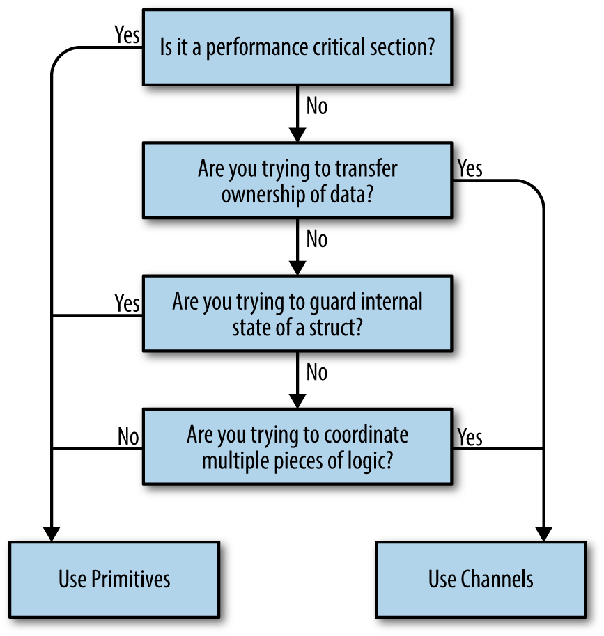

# Concurrency in Go

by Katherine Cox-Buday

# Chapter 2.  
Modeling Your Code: Communicating Sequential Processes


* [The Difference Between Concurrency and Parallelism](#the-difference-between-concurrency-and-parallelism)
                * [Is This Really a Silly Example?](#is-this-really-a-silly-example)
* [What Is CSP?](#what-is-csp)
* [How This Helps You](#how-this-helps-you)
* [Go’s Philosophy on Concurrency](#gos-philosophy-on-concurrency)


## The Difference Between Concurrency and Parallelism

The fact that *concurrency* is different from *parallelism* is often overlooked 
or misunderstood. In conversations between many developers, the two terms are 
often used interchangeably to mean “something that runs at the same time as 
something else.” Sometimes using the word“parallel” in this context is correct, 
but usually if the developers are discussing code, they really ought to be using 
the word“concurrent.”

The reason to differentiate goes well beyond pedantry. The difference between 
concurrency and parallelism turns out to be a very powerful abstraction when 
modeling your code, and Go takes full advantage of this. Let’s take a look at 
how the two concepts are different so that we can understand the power of this 
abstraction. We’ll start with a very simple statement:

> Concurrency is a property of the code; parallelism is a property of
> the running <span class="keep-together">program</span>.

That’s kind of an interesting distinction. Don’t we usually think about these 
two things the same way? We write our code so that it will execute in parallel. 
Right?

Well, let’s think about that for second. If I write my code with the intent that 
two chunks of the program will run in parallel, do I have any guarantee that 
will actually happen when the program is run? What happens if I run the code on 
a machine with only one core? Some of you may be thinking, *It will run in 
parallel*, but this isn’t true\!

The chunks of our program may *appear* to be running in parallel, but really 
they’re executing in a sequential manner faster than is distinguishable. The CPU 
context switches to share time between different programs, and over a coarse 
enough granularity of time, the tasks appear to be running in parallel. If we 
were to run the same binary on a machine with two cores, the program’s chunks 
might actually be running in parallel.

This reveals a few interesting and important things. The first is that we do not 
write parallel code, only concurrent code that we *hope* will be run in 
parallel. Once again, parallelism is a property of the *runtime* of our program, 
not the code.

The second interesting thing is that we see it is possible—maybe even desirable—
to be ignorant of whether our concurrent code is actually running in parallel. 
This is only made possible by the layers of abstraction that lie beneath our 
program’s model: the concurrency primitives, the program’s runtime, the 
operating system, the platform the operating system runs on (in the case of 
hypervisors, containers, and virtual machines), and ultimately the CPUs. These 
abstractions are what allow us to make the distinction between concurrency and 
parallelism, and ultimately what give us the power and flexibility to express 
ourselves. We’ll come back to this.

The third and final interesting thing is that parallelism is a function of time, 
or context. Remember in [“Atomicity”][1] where we discussed the concept of 
context? There, context was defined as the bounds by which an operation was 
considered atomic. Here, it’s defined as the bounds by which two or more 
operations could be considered parallel.

[1]: ./ch01-an-introduction-to-concurrency.md#atomicity

For example, if our context was a space of five seconds, and we ran two 
operations that each took a second to run, we would consider the operations to 
have run in parallel. If our context was one second, we would consider the 
operations to have run sequentially.

It may not do us much good to go about redefining our context in terms of time 
slices, but remember context isn’t constrained to time. We can define a context 
as the process our program runs within, its operating system thread, or its 
machine. This is important because the context you define is closely related to 
the concept of concurrency and correctness.  Just as atomic operations can be 
considered atomic depending on the context you define, concurrent operations are 
correct depending on the context you define. It’s all relative.

That’s a bit abstract, so let’s look at an example. Let’s say the context we’re 
discussing is your computer. Theoretical physics aside, we can reasonably expect 
that a process executing on my machine isn’t going to affect the logic of a 
process on your machine. If we both start a calculator process and begin 
performing some simple arithmetic, the calculations I perform shouldn’t affect 
the calculations you perform.

It’s a silly example, but if we break it down, we see all the pieces in play: 
our machines are the context, and the processes are the concurrent operations. 
In this case, we have chosen to model our concurrent operations by thinking of 
the world in terms of separate computers, operating systems, and processes. 
These abstractions allow us to confidently assert correctness.


##### Is This Really a Silly Example?

Using individual computers seems like a contrived example to make a point, but 
personal computers weren’t always so ubiquitous\! Up until the late 1970s, 
mainframes were the norm, and the common context developers used when thinking 
about problems concurrently was a program’s process.

Now that many developers are working with distributed systems, it’s shifting 
back the other way\! We’re now beginning to think in terms of hypervisors, 
containers, and virtual machines as our concurrent contexts.

We can reasonably expect one process on a machine to remain unaffected by a 
process on another machine (assuming they’re not part of the same distributed 
system), but can we expect two processes on the *same* machine to not affect the 
logic of one another? Process `A` may overwrite some files process `B` is 
reading, or in an insecure OS, process `A` may even corrupt memory process `B` 
is reading. Doing so intentionally is how many exploits work.

Still, at the process level, things remain relatively easy to think about. If we 
return to our calculator example, it’s still reasonable to expect that two users 
running two calculator processes on the same machine should reasonably expect 
their operations to be logically isolated from one another. Fortunately, the 
process boundary and the OS help us think about these problems in a logical 
manner. But we can see that the developer begins to be burdened with some 
concerns of concurrency, and this problem only gets worse.

What if we move down one more level to the OS thread boundary? It is here that 
all the problems enumerated in the section [“Why Is Concurrency Hard?”][2] 
really come to bear: race conditions, deadlocks, livelocks, and starvation. If 
we had *one* calculator process that all users on a machine had views into, it 
would be more difficult to get the concurrent logic right. We would have to 
begin worrying about synchronizing access to the memory and retrieving the 
correct results for the correct user.

[2]: ./ch01-an-introduction-to-concurrency.md#why-is-concurrency-hard

What’s happening is that as we begin moving down the stack of abstraction, the 
problem of modeling things concurrently is becoming both more difficult to 
reason about, and more important. Conversely, our abstractions are becoming more 
and more important to us. In other words, the more difficult it is to get 
concurrency right, the more important it is to have access to concurrency 
primitives that are easy to compose.  Unfortunately, most concurrent logic in 
our industry is written at one of the highest levels of abstraction: OS threads.

Before Go was first revealed to the public, this was where the chain of 
abstraction ended for most of the popular programming languages. If you wanted 
to write concurrent code, you would model your program in terms of threads and 
synchronize the access to the memory between them. If you had a lot of things 
you had to model concurrently and your machine couldn’t handle that many 
threads, you created a *thread pool* and multiplexed your operations onto the 
thread pool.

Go has added another link in that chain: the *goroutine*. In addition, Go has 
borrowed several concepts from the work of famed computer scientist Tony Hoare, 
and introduced new primitives for us to use, namely *channels*.

If we continue the line of reasoning we have been following, we’d assume that 
introducing another level of abstraction below OS threads would bring with it 
more difficulties, but the interesting thing is that it *doesn’t*. It actually 
makes things *easier*. This is because we haven’t really added another layer of 
abstraction on top of OS threads, we’ve supplanted them.

Threads are still there, of course, but we find that we rarely have to think 
about our problem space in terms of OS threads. Instead, we model things in 
goroutines and channels, and occasionally shared memory. This leads to some 
interesting properties that we explore in the section [“How This Helps You”]
(#how_this_helps_you). But first, let’s take a closer look at where Go got a lot 
of its ideas—the paper at the root of Go’s concurrency primitives: Tony Hoare’s 
seminal paper, “Communicating Sequential Processes.”


## What Is CSP?

When Go is discussed, you’ll often hear people throw around the acronym *CSP*. 
Often in the same breath it’s lauded as the reason for Go’s success, or a 
panacea for concurrent programming. It’s enough to make people who don’t know 
what CSP is begin to think that computer science had discovered some new 
technique that magically makes programming concurrent programs as simple as 
writing procedural ones. While CSP does make things easier, and programs more 
robust, it is unfortunately not a miracle. So what is it? What has everyone so 
excited?

CSP stands for “Communicating Sequential Processes,” which is both a technique 
and the name of the paper that introduced it. In 1978, Charles Antony Richard 
Hoare published the [paper][3] in the Association for Computing Machinery (more 
popularly referred to as ACM).

[3]: http://bit.ly/HoareCSP

In this paper, Hoare suggests that input and output are two overlooked 
primitives of programming—particularly in concurrent code. At the time Hoare 
authored this paper, research was still being done on how to structure programs, 
but most of this effort was being directed to techniques for sequential code: 
usage of the `goto` statement was being debated, and the object-oriented 
paradigm was beginning to take root.  Concurrent operations weren’t being given 
much thought. Hoare set out to correct this, and thus his paper, and CSP, were 
born.

In the 1978 paper, CSP was only a simple programming language constructed solely 
to demonstrate the power of communicating sequential processes; in fact, he even 
says in the paper:

> Thus the concepts and notations introduced in this paper should … not be 
> regarded as suitable for use as a programming language, either for abstract or 
> for concrete programming.

Hoare was deeply concerned that the techniques he was presenting did nothing to 
further the study of correctness of programs, and that the techniques may not be 
performant in a real language based on his own. Over the next six years, the 
idea of CSP was refined into a formal representation of something called 
*process calculus* in an effort to take the ideas of communicating sequential 
processes and actually begin to reason about program correctness. Process 
calculus is a way to mathematically model concurrent systems and also provides 
algebraic laws to perform transformations on these systems to analyze their 
various properties, e.g., efficiency and correctness. Although process calculi 
are an interesting topic in their own right, they are beyond the scope of this 
book. And since the original paper on CSP and the language that evolved from it 
were largely the inspiration for Go’s concurrency model, it’s these we’ll focus 
on.

To support his assertion that inputs and outputs needed to be considered 
language primitives, Hoare’s CSP programming language contained primitives to 
model input and output, or *communication*, between *processes* correctly (this 
is where the paper’s name comes from). Hoare applied the term *processes* to any 
encapsulated portion of logic that required input to run and produced output 
other processes would consume.  Hoare probably could have used the word 
“function” were it not for the debate on how to structure programs occurring in 
the community when he wrote his paper.

For communication between the processes, Hoare created input and output 
*commands*: `!` for sending input into a process, and `?` for reading output 
from a process. Each command had to specify either an output variable (in the 
case of reading a variable out of a process), or a destination (in the case of 
sending input to a process). Sometimes these two would refer to the same thing, 
in which case the two processes would be said to *correspond*. In other words, 
output from one process would flow directly into the input of another process. 
[Table 2-1](#an_extract_of_some_examples_from_hoares) shows a few examples from 
the paper.

| Operation                         | Explanation                                                                                                                                   |
| --------------------------------- | --------------------------------------------------------------------------------------------------------------------------------------------- |
| `cardreader?cardimage`            | From `cardreader`, read a card and assign its value (an array of characters) to the variable `cardimage`.                                     |
| `lineprinter!lineimage`           | To `lineprinter`, send the value of `lineimage` for printing.                                                                                 |
| `X?(x, y)`                        | From process named `X`, input a pair of values and assign them to `x` and `y`.                                                                |
| `DIV!(3*a+b, 13)`                 | To process `DIV`, output the two specified values.                                                                                            |
| `*[c:character; west?c → east!c]` | Read all the characters output by `west`, and output them one by one to `east`. The repetition terminates when the process `west` terminates. |

<span id="an_extract_of_some_examples_from_hoares"></span>Table 2-1. An extract of some examples from
Hoare’s CSP paper

The similarities to Go’s channels are apparent. Notice how in the last example 
the output from `west` was sent to a variable `c` and the input to `east` was 
received from the same variable. These two processes correspond. In Hoare’s 
first paper on CSP, processes could only communicate via named sources and 
destinations. He acknowledged that this would cause issues with embedding code 
as a library, as consumers of the code would have to know the names of the 
inputs and outputs. He casually mentioned the possibility of registering what he 
called “port names,” in which names could be declared in the head of the 
parallel command, something we would probably recognize as named parameters and 
named return values.

The language also utilized a so-called *guarded command*, which Edgar Dijkstra 
had introduced in a previous paper written in 1974, [“Guarded commands, 
nondeterminacy and formal derivation of programs”][4]. A guarded command is 
simply a statement with a left- and righthand side, split by a `→`. The lefthand 
side served as a conditional, or *guard* for the righthand side in that if the 
lefthand side was false or, in the case of a command, returned false or had 
exited, the righthand side would never be executed. Combining these with Hoare’s 
I/O commands laid the foundation for Hoare’s communicating processes, and thus 
Go’s channels.

[4]: http://bit.ly/DijkstraGuarded

Using these primitives, Hoare walked through several examples and demonstrated 
how a language with first-class support for modeling communication makes solving 
problems simpler and easier to comprehend.  Some of the notation he uses is a 
little terse (perl programmers would probably disagree\!), but the problems he 
presents have extraordinarily clear solutions. Similar solutions in Go are a bit 
longer, but also carry with them this clarity.

History has judged Hoare’s suggestion to be correct; however, it’s interesting 
to note that before Go was released, few languages have really brought support 
for these primitives into the language. Most popular languages favor sharing and 
synchronizing access to the memory to CSP’s message-passing style. There are 
exceptions, but unfortunately these are confined to languages that haven’t seen 
wide adoption. Go is one of the first languages to incorporate principles from 
CSP in its core, and bring this style of concurrent programming to the masses. 
Its success has led other languages to attempt to add these primitives as well.

Memory
access synchronization isn’t inherently bad. We’ll see later in the
chapter (in [“Go’s Philosophy on Concurrency”](#go_philosophy)) that
sometimes sharing memory is appropriate in certain situations, even in
Go. However, the shared memory model *can* be difficult to utilize
correctly—especially in large or complicated programs. It’s for this
reason that concurrency is considered one of Go’s strengths: it has been
built from the start with principles from CSP in mind and therefore it
is easy to read, write, and reason
about.


## How This Helps You

You may or may not find all of this fascinating, but chances are that if you’re 
reading this book you have problems to solve, and you’re wondering why any of 
this matters. What does Go do so differently that has set it apart from other 
popular languages when it comes to concurrency?

As we discussed in the section [“The Difference Between Concurrency and
Parallelism”](#dif_concur_parallel) for modeling concurrent problems,
it’s common for languages to end their chain of abstraction at the
level of the OS thread and memory access synchronization. Go takes a
different route and supplants this with the concept of goroutines and
channels.

If we were to draw a comparison between concepts in the two ways of abstracting 
concurrent code, we’d probably compare the goroutine to a thread, and a channel 
to a mutex (these primitives only have a passing resemblance, but hopefully the 
comparison helps you get your bearings).  What do these different abstractions 
do for us?

Goroutines free us from having to think about our problem space in terms of 
parallelism and instead allow us to model problems closer to their natural level 
of concurrency. Although we went over the difference between concurrency and 
parallelism, how that difference affects how we model solutions might not be 
clear. Let’s jump into an example.

Let’s say I need to build a web server that fields requests on an endpoint. 
Setting aside frameworks for a moment, in a language that only offers a thread 
abstraction, I would probably be ruminating on the following questions:

  - Does my language naturally support threads, or will I have to pick a 
    library?

  - Where should my thread confinement boundaries be?

  - How heavy are threads in this operating system?

  - How do the operating systems my program will be running in handle threads 
    differently?

  - I should create a pool of workers to constrain the number of threads I 
    create. How do I find the optimal number?

All of these are important things to consider, but none of them directly concern 
the problem you’re trying to solve. You’ve immediately been yanked down into the 
technicalities of how you’re going to solve the problem of parallelism.

If we step back and think about the natural problem, we could state it as such: 
individual users are connecting to my endpoint and opening a session. The 
session should field their request and return a response.  In Go, we can almost 
directly represent the natural state of this problem in code: we would create a 
goroutine for each incoming connection, field the request there (potentially 
communicating with other goroutines for data/services), and then return from the 
goroutine’s function. How we naturally think about the problem maps directly to 
the natural way to code things in Go.

This is achieved by a promise Go makes to us: that goroutines are lightweight, 
and we normally won’t have to worry about creating one.  There are appropriate 
times to consider how many goroutines are running in your system, but doing so 
upfront is soundly a premature optimization. Contrast this with threads where 
you would be wise to consider such matters upfront.

Just because there is a framework available for a language that abstracts the 
concerns of parallelism away for you, doesn’t mean this natural way of modeling 
concurrent problems doesn’t matter! Someone has to write the framework, and 
your code will be sitting on top of whatever complexity the author(s) had to 
deal with. Just because the complexity is hidden from you doesn’t mean it’s not 
there, and complexity breeds bugs. In the case of Go, the language was designed 
around concurrency, so the language is not incongruent with the concurrency 
primitives it provides. This means less friction and fewer bugs!

A more natural mapping to the problem space is an *enormous* benefit, but it has 
a few beneficial side effects as well. Go’s runtime multiplexes goroutines onto 
OS threads automatically and manages their scheduling for us. This means that 
optimizations to the runtime can be made without us having to change how we’ve 
modeled our problem; this is classic separation of concerns. As advancements in 
parallelism are made, Go’s runtime will improve, as will the performance of your 
program—all for free. Keep an eye on Go’s release notes and occasionally you’ll 
see things like:

    In Go 1.5, the order in which goroutines are scheduled has been changed.

The Go authors are making improvements behind the scenes to make your program 
faster.

This decoupling of concurrency and parallelism has another benefit: because Go’s 
runtime is managing the scheduling of goroutines for you, it can introspect on 
things like goroutines blocked waiting for I/O and intelligently reallocate OS 
threads to goroutines that are not blocked.  This also increases the performance 
of your code. We’ll discuss more of what Go’s runtime does for you in [Chapter 
6][5].

[5]: ./ch06-goroutines-and-go-runtime.md#goroutines_and_the_go_runtime

Yet another benefit of the more natural mapping between problem spaces and Go 
code is the likely increased amount of the problem space modeled in a concurrent 
manner. Because the problems we work on as developers are naturally concurrent 
more often than not, we’ll naturally be writing concurrent code at a finer level 
of granularity than we perhaps would in other languages; e.g., if we go back to 
our web server example, we would now have a goroutine for every user instead of 
connections multiplexed onto a thread pool. This finer level of granularity 
enables our program to scale *dynamically* when it runs to the amount of 
parallelism possible on the program’s host—Amdahl’s law in action! That’s kind 
of amazing.

And goroutines are only one piece of the puzzle. The other concepts from CSP, 
channels and select statements, add value as well.

Channels, for instance, are inherently *composable* with other channels.  This 
makes writing large systems simpler because you can coordinate the input from 
multiple subsystems by easily composing the output together.  You can combine 
input channels with timeouts, cancellations, or messages to other subsystems. 
Coordinating mutexes is a much more difficult proposition.

The `select` statement is the complement to Go’s channels and is what enables 
all the difficult bits of composing channels. `select` statements allow you to 
efficiently wait for events, select a message from competing channels in a 
uniform random way, continue on if there are no messages waiting, and more.

This wonderful tapestry of primitives inspired by CSP and the runtime that 
supports it are the things that power Go. We’ll spend the rest of the book 
discovering how these things work, why, and how we can use them to write amazing 
code.


## Go’s Philosophy on Concurrency

CSP was and *is* a large part of what Go was designed around; however, Go also 
supports more traditional means of writing concurrent code through memory access 
synchronization and the primitives that follow that technique. Structs and 
methods in the `sync` and other packages allow you to perform locks, create 
pools of resources, preempt goroutines, and more.

This ability to choose between CSP primitives and memory access synchronizations 
is great for you since it gives you a little more control over what style of 
concurrent code you choose to write to solve problems, but it can also be a 
little confusing. Newcomers to the language often get the impression that the 
CSP style of concurrency is considered the one and only way to write concurrent 
code in Go. For instance, in the documentation for the `sync` package, it says:

> Package sync provides basic synchronization primitives such as mutual exclusion 
> locks. Other than the Once and WaitGroup types, most are intended for use by 
> low-level library routines. Higher-level synchronization is better done via 
> channels and communication.

In the [language FAQ][7], it says:

> Regarding mutexes, the sync package implements them, but we hope Go programming 
> style will encourage people to try higher-level techniques. In particular, 
> consider structuring your program so that only one goroutine at a time is ever 
> responsible for a particular piece of data.
> 
> Do not communicate by sharing memory. Instead, share memory by communicating.

[7]: https://golang.org/doc/faq

There are also numerous articles, lectures, and interviews where various members 
of the Go core team espouse the CSP style over primitives like `sync.Mutex`.

It is therefore completely understandable to be confused as to why the Go team 
chose to expose memory access synchronization primitives at all.  What may be 
even more confusing is that you’ll see synchronization primitives commonly out 
in the wild, see people complain about overuse of channels, and also hear some 
of the Go team members stating that it’s OK to use them. Here’s a quote from the 
Go [Wiki][8] on the matter:

[8]: https://github.com/golang/go/wiki/MutexOrChannel

> One of Go’s mottos is “Share memory by communicating, don’t communicate by 
> sharing memory.”
> 
> That said, Go does provide traditional locking mechanisms in the sync package. 
> Most locking issues can be solved using either channels or traditional locks.
> 
> So which should you use?
> 
> Use whichever is most expressive and/or most simple.

That’s good advice, and this is a guideline you often see when working with Go, 
but it is a little vague. How do we understand what is more expressive and/or 
simpler? What criteria can we use? Fortunately there are some guideposts we can 
use to help us do the correct thing. As we’ll see, the way we can mostly 
differentiate comes from where we’re trying to manage our concurrency: 
internally to a tight scope, or externally throughout our system. 
[Figure 2-1](#decision_tree_chapthree) enumerates these guideposts into a 
decision tree.



Let’s step through these decision points one by one:

  - Are you trying to transfer ownership of data?  
    If you have a bit of code that produces a result and wants to share that 
    result with another bit of code, what you’re really doing is transferring 
    ownership of that data. If you’re familiar with the concept of memory-
    ownership in languages that don’t support garbage collection, this is the 
    same idea: data has an owner, and one way to make concurrent programs safe 
    is to ensure only one concurrent context has ownership of data at a time. 
    Channels help us communicate this concept by encoding that intent into the 
    channel’s type.  One large benefit of doing so is you can create buffered 
    channels to implement a cheap in-memory queue and thus decouple your 
    producer from your consumer. Another is that by using channels, you’ve 
    implicitly made your concurrent code *composable* with other concurrent 
    code.

  - Are you trying to guard internal state of a struct?  
    This is a great candidate for memory access synchronization primitives, and 
    a pretty strong indicator that you shouldn’t use channels. By using memory 
    access synchronization primitives, you can hide the implementation detail of 
    locking your critical section from your callers. Here’s a small example of a 
    type that is thread-safe, but doesn’t expose that complexity to its callers:
    ```go
      type Counter struct {
          mu sync.Mutex
          value int
      }
      func (c *Counter) Increment() {
          c.mu.Lock()
          defer c.mu.Unlock()
          c.value++
      }
    ```

    If you recall the concept of atomicity, we can say that what we’ve done here 
    is defined the scope of atomicity for the `Counter` type.  Calls to 
    `Increment` can be considered atomic.

    Remember the key word here is *internal*. If you find yourself exposing 
    locks beyond a type, this should raise a red flag. Try to keep the locks 
    constrained to a small lexical scope.

  - Are you trying to coordinate multiple pieces of logic?  
    Remember that channels are inherently more composable than memory access 
    synchronization primitives. Having locks scattered throughout your object-
    graph sounds like a nightmare, but having channels everywhere is expected 
    and encouraged! I can compose channels, but I can’t easily compose locks or 
    methods that return values.

    You will find it much easier to control the emergent complexity that arises 
    in your software if you use channels because of Go’s `select` statement, and 
    their ability to serve as queues and be safely passed around. If you find 
    yourself struggling to understand how your concurrent code works, why a 
    deadlock or race is occurring, and you’re using primitives, this is probably 
    a good indicator that you should switch to channels.

  - Is it a performance-critical section?  
    This absolutely does *not* mean, “I want my program to be performant, 
    therefore I will only use mutexes.” Rather, if you have a section of your 
    program that you have profiled, and it turns out to be a major bottleneck 
    that is orders of magnitude slower than the rest of the program, using 
    memory access synchronization primitives may help this critical section 
    perform under load.  This is because channels *use* memory access 
    synchronization to operate, therefore they can only be slower. Before we 
    even consider this, however, a performance-critical section might be hinting 
    that we need to restructure our program.

Hopefully, this gives some clarity around whether to utilize CSP-style 
concurrency or memory access synchronization. There are other patterns and 
practices that are useful in languages that use the OS thread as the means of 
abstracting concurrency. For example, things like thread pools often come up. 
Because most of these abstractions are targeted toward the strengths and 
weaknesses of OS threads, a good rule of thumb when working with Go is to 
discard these patterns. That’s not to say they aren’t useful at all, but the use 
cases are certainly much more constrained in Go. Stick to modeling your problem 
space with goroutines, use them to represent the concurrent parts of your 
workflow, and don’t be afraid to be liberal when starting them. You’re much more 
likely to need to restructure your program than you are to begin running into 
the upper limit of how many goroutines your hardware can support.

Go’s philosophy on concurrency can be summed up like this: aim for simplicity, 
use channels when possible, and treat goroutines like a free
resource.
