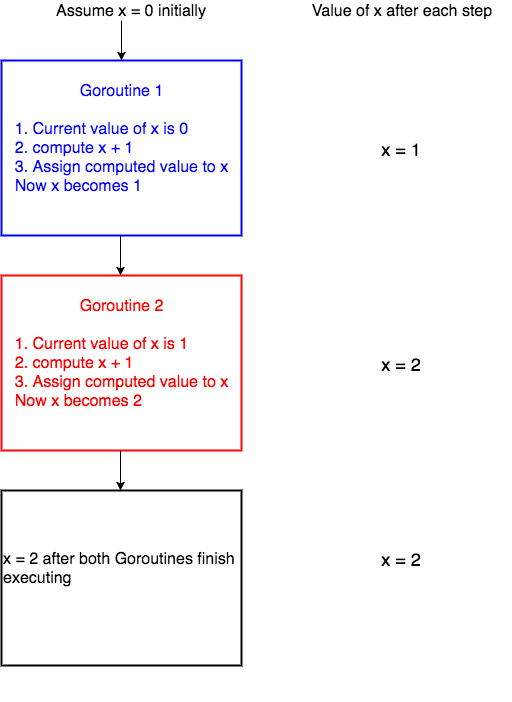

[Part 25: Mutex][1]

15 August 2017

[Golang tutorial series][2]

[1]: https://golangbot.com/mutex/
[2]: https://golangbot.com/learn-golang-series/
[3]: ../channels/gb-channels.md
[4]: https://en.wikipedia.org/wiki/Critical_section
[5]: ../goroutines/gb-goroutines.md

In this tutorial we will learn about mutexes. We will also learn how to solve 
race conditions using mutexes and [channels][3].

### Critical section

Before jumping to mutex, it is important to understand the concept of [critical 
section][4] in concurrent programming. When a program runs concurrently, the 
parts of code which modify shared resources should not be accessed by multiple 
[Goroutines][5] at the same time. This section of code which modifies shared 
resources is called critical section. For example lets assume that we have some 
piece of code which increments a variable x by 1.

```go
x = x + 1  
```

As long as the above piece of code is accessed by a single Goroutine, there 
shouldn't be any problem.

Let's see why this code will fail when there are multiple Goroutines running 
concurrently. For the sake of simplicity lets assume that we have 2 Goroutines 
running the above line of code concurrently.

Internally the above line of code will be executed by the system in the 
following steps(there are more technical details involving registers, how 
addition works and so on but for the sake of this tutorial lets assume that 
these are the three steps),

1.  get the current value of x
2.  compute x + 1
3.  assign the computed value in step 2 to x

When these three steps are carried out by only one Goroutine, all is well.

Lets discuss what happens when 2 Goroutines run this code concurrently.  The 
picture below depicts one scenario of what could happen when two Goroutines 
access the line of code `x = x + 1` concurrently.


We have assumed the initial value of x to be 0. *Goroutine 1* gets the initial 
value of x, computes x + 1 and before it could assign the computed value to x, 
the system context switches to `Goroutine 2`. Now `Goroutine 2` gets the initial 
value of `x` which is still `0`, computes `x + 1`. After this the system context 
switches again to *Goroutine 1*.  Now *Goroutine 1* assigns its computed value 
*1* to *x* and hence x becomes 1. Then *Goroutine 2* starts execution again and 
then assigns its computed value, which is again `1` to `x` and hence `x` is `1` 
after both Goroutines execute.

Now lets see a different scenario of what could happen.



In the above scenario, `Goroutine 1` starts execution and finishes all its three 
steps and hence the value of x becomes `1`. Then `Goroutine 2` starts execution. 
Now the value of `x` is 1 and when `Goroutine 2` finishes execution, the value 
of `x` is `2`.

So from the two cases you can see that the final value of x is `1` or `2` 
depending on how context switching happens. This type of undesirable situation 
where the output of the program depends on the sequence of execution of 
Goroutines is called **[race condition][6]**.

[6]: https://en.wikipedia.org/wiki/Race_condition

In the above scenario, the race condition could have been avoided if only one 
Goroutine was allowed to access the critical section of the code at any point of 
time. This is made possible by using Mutex.

### Mutex

A Mutex is used to provide a locking mechanism to ensure that only one Goroutine 
is running the critical section of code at any point of time to prevent race 
condition from happening.

Mutex is available in the [sync][7] package.  There are two methods defined on 
[Mutex][8] namely [Lock][9] and [Unlock][10]. Any code that is present between a 
call to `Lock` and `Unlock` will be executed by only one Goroutine, thus 
avoiding race condition.

[7]: https://golang.org/pkg/sync/
[8]: https://tip.golang.org/pkg/sync/#Mutex
[9]: https://tip.golang.org/pkg/sync/#Mutex.Lock
[10]: https://tip.golang.org/pkg/sync/#Mutex.Unlock

```go
mutex.Lock()  
x = x + 1  
mutex.Unlock()  
```

In the above code, `x = x + 1` will be executed by only one Goroutine at any 
point of time thus preventing race condition.

**If one Goroutine already holds the lock and if a new Goroutine is trying to 
acquire a lock, the new Goroutine will be blocked until the mutex is unlocked.**

### Program with race condition

In this section, we will write a program which has race condition and in the 
upcoming sections we will fix the race condition.

```go
package main  

import (  
    "fmt"
    "sync"
    )

var x  = 0  

func increment(wg *sync.WaitGroup) {  
    x = x + 1
    wg.Done()
}

func main() {  
    var w sync.WaitGroup
    for i := 0; i < 1000; i++ {
        w.Add(1)        
        go increment(&w)
    }
    w.Wait()
    fmt.Println("final value of x", x)
}
```

In the program above, the `increment` function in line no. 7 increments the 
value of `x` by `1` and then calls `Done()` on the [WaitGroup][11] to notify its 
completion.

[11]: https://golangbot.com/buffered-channels-worker-pools#waitgroup

We spawn 1000 `increment` Goroutines from line no. 15 of the program above. Each 
of these Goroutines run concurrently and race condition occurs when trying to 
increment x is line no. 8 as multiple Goroutines try to access the value of x 
concurrently.

*Please run this program in your local as the playground is deterministic and 
the race condition will not occur in the playground.* Run this program multiple 
times in your local machine and you can see that the output will be different 
for each time because of race condition. Some of the outputs which I encountered 
are `final value of x 941`, `final value of x 928`, `final value of x 922` and 
so on.


### Solving the race condition using mutex

In the program above, we spawn 1000 Goroutines. If each increments the value of 
x by 1, the final desired value of x should be 1000. In this section, we will 
fix the race condition in the program above using mutex.

```go
package main  

import (  
    "fmt"
    "sync"
    )

var x  = 0  

func increment(wg *sync.WaitGroup, m *sync.Mutex) {  
    m.Lock()
    x = x + 1
    m.Unlock()
    wg.Done()   
}

func main() {  
    var w sync.WaitGroup
    var m sync.Mutex
    for i := 0; i < 1000; i++ {
        w.Add(1)        
        go increment(&w, &m)
    }
    w.Wait()
    fmt.Println("final value of x", x)
}
```

[Run in playground](https://play.golang.org/p/VX9dwGhR62)

[Mutex][8] is a struct type and we create a zero valued variable `m` of type 
`Mutex` in line no. 15. In the above program we have changed the `increment` 
function so that the code which increments x `x = x + 1` is between `m.Lock()` 
and `m.Unlock()`.  Now this code is void of any race conditions since only one 
Goroutine is allowed to execute this piece of code at any point of time.

Now if this program is run, it will output

``` 
final value of x 1000  
```

It is important to pass the address of the mutex in line no. 18. If the mutex is 
passed by value instead of passing the address, each Goroutine will have its own 
copy of the mutex and the race condition will still occur.

### Solving the race condition using channel

We can solve the race condition using channels too. Lets see how this is done.

```go
package main  

import (  
    "fmt"
    "sync"
    )

var x  = 0  

func increment(wg *sync.WaitGroup, ch chan bool) {  
    ch <- true
    x = x + 1
    <- ch
    wg.Done()   
}

func main() {  
    var w sync.WaitGroup
    ch := make(chan bool, 1)
    for i := 0; i < 1000; i++ {
        w.Add(1)        
        go increment(&w, ch)
    }
    w.Wait()
    fmt.Println("final value of x", x)
}
```

[Run in playground](https://play.golang.org/p/M1fPEK9lYz)

In the program above, we have created a [buffered channel][12] of capacity `1` 
and this is passed to the `increment` Goroutine in line no.  18. This buffered 
channel is used to ensure that only one Goroutine access the critical section of 
code which increments x. This is done by passing `true` to the buffered channel 
in line no. 8 just before `x` is incremented. Since the buffered channel has a 
capacity of `1`, all other Goroutines trying to write to this channel are 
blocked until the value is read from this channel after incrementing x in line 
no. 10.  Effectively this allows only one Goroutine to access the critical 
section.

[12]: https://golangbot.com/buffered-channels-worker-pools/

This program also prints

``` 
final value of x 1000  
```

### Mutex vs Channels

We have solved the race condition problem using both mutexes and channels. So 
how do we decide what to use when. The answer lies in the problem you are trying 
to solve. If the problem you are trying to solve is a better fit for mutexes 
then go ahead and use mutex. Do not hesitate to use mutex if needed. If the 
problem seems to be a better fit for channels, then use it :).

Most Go newbies try to solve every concurrency problem using a channel as it is 
a cool feature of the language. This is wrong. The language gives us the option 
to either use Mutex or Channel and there is no wrong in choosing either.

In general use channels when Goroutines need to communicate with each other and 
mutexes when only one Goroutine should access the critical section of code.

In the case of the problem which we solved above, I would prefer to use mutex 
since this problem does not require any communication between the goroutines. 
Hence mutex would be a natural fit.

My advice would be to choose the tool for the problem and do not try to fit the 
problem for the tool :)

This brings us to an end of this tutorial. Have a great day.
