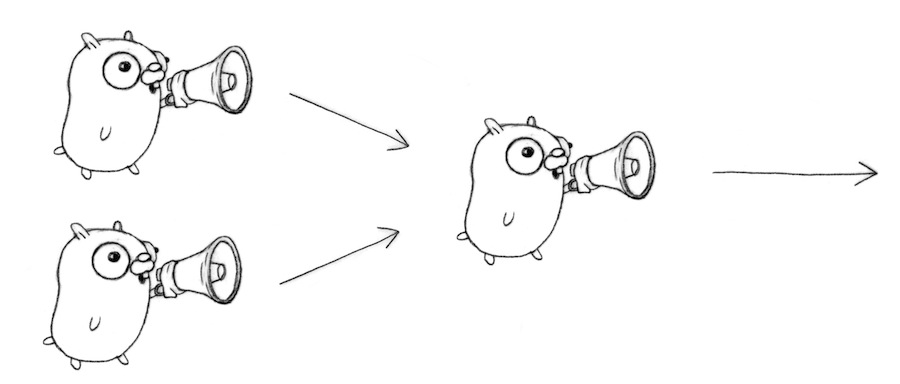

# Go Concurrency Patterns

Rob Pike

Google

### Video

This talk was presented at Google I/O in June 2012.

[Watch the talk on YouTube](http://www.youtube.com/watch?v=f6kdp27TYZs)


## Introduction

### Concurrency features in Go

People seemed fascinated by the concurrency features of Go when the language was 
first announced.

Questions:

  - Why is concurrency supported?
  - What is concurrency, anyway?
  - Where does the idea come from?
  - What is it good for?
  - How do I use it?


### Why?

Look around you. What do you see?

Do you see a single-stepping world doing one thing at a time?

Or do you see a complex world of interacting, independently behaving pieces?

That's why. Sequential processing on its own does not model the world's 
behavior.

### What is concurrency?

Concurrency is the composition of independently executing computations.

Concurrency is a way to structure software, particularly as a way to write clean 
code that interacts well with the real world.

It is not parallelism.

### Concurrency is not parallelism

Concurrency is not parallelism, although it enables parallelism.

If you have only one processor, your program can still be concurrent but it 
cannot be parallel.

On the other hand, a well-written concurrent program might run efficiently in 
parallel on a multiprocessor. That property could be important...

For more on that distinction, see the link below. Too much to discuss here.

[golang.org/s/concurrency-is-not-parallelism](http://golang.org/s/concurrency-is-not-parallelism)

### A model for software construction

Easy to understand.

Easy to use.

Easy to reason about.

You don't need to be an expert!

(Much nicer than dealing with the minutiae of parallelism (threads, semaphores, 
locks, barriers, etc.))


### History

To many, the concurrency features of Go seemed new.

But they are rooted in a long history, reaching back to Hoare's CSP in 1978 and 
even Dijkstra's guarded commands (1975).

Languages with similar features:

  - Occam (May, 1983)
  - Erlang (Armstrong, 1986)
  - Newsqueak (Pike, 1988)
  - Concurrent ML (Reppy, 1993)
  - Alef (Winterbottom, 1995)
  - Limbo (Dorward, Pike, Winterbottom, 1996).

### Distinction

Go is the latest on the Newsqueak-Alef-Limbo branch, distinguished by first-
class channels.

Erlang is closer to the original CSP, where you communicate to a process by name 
rather than over a channel.

The models are equivalent but express things differently.

Rough analogy: writing to a file by name (process, Erlang) vs. writing to a file 
descriptor (channel, Go).

## Basic Examples

### A boring function

We need an example to show the interesting properties of the concurrency 
primitives.

To avoid distraction, we make it a boring example.

```go
package main

import (
    "fmt"
    "time"
)

func main() {
    boring("boring!")
}

func boring(msg string) {
    for i := 0; ; i++ {
        fmt.Println(msg, i)
        time.Sleep(time.Second)
    }
}
```


### Slightly less boring

Make the intervals between messages unpredictable (still under a second).

```go
package main

import (
    "fmt"
    "math/rand"
    "time"
)

func main() {
    boring("boring!") // HL
}

func boring(msg string) {
    for i := 0; ; i++ {
        fmt.Println(msg, i)
        time.Sleep(time.Duration(rand.Intn(1e3)) * time.Millisecond)
    }
}
```


### Running it

The boring function runs on forever, like a boring party guest.

```go
package main

import (
    "fmt"
    "math/rand"
    "time"
)

func main() {
    boring("boring!")
}

func boring(msg string) {
    for i := 0; ; i++ {
        fmt.Println(msg, i)
        time.Sleep(time.Duration(rand.Intn(1e3)) * time.Millisecond)
    }
}
```


### Ignoring it

The go statement runs the function as usual, but doesn't make the caller wait.

It launches a goroutine.

The functionality is analogous to the & on the end of a shell command.

```go
package main

import (
    "fmt"
    "math/rand"
    "time"
)

func main() {
    go boring("boring!")
}

func boring(msg string) {
    for i := 0; ; i++ {
        fmt.Println(msg, i)
        time.Sleep(time.Duration(rand.Intn(1e3)) * time.Millisecond)
    }
}
```


### Ignoring it a little less

When main returns, the program exits and takes the boring function down with it.

We can hang around a little, and on the way show that both main and the launched 
goroutine are running.

```go
// +build OMIT

package main

import (
    "fmt"
    "math/rand"
    "time"
)

func main() {
    go boring("boring!")
    fmt.Println("I'm listening.")
    time.Sleep(2 * time.Second)
    fmt.Println("You're boring; I'm leaving.")
}

func boring(msg string) {
    for i := 0; ; i++ {
        fmt.Println(msg, i)
        time.Sleep(time.Duration(rand.Intn(1e3)) * time.Millisecond)
    }
}
```


### Goroutines

What is a goroutine? It's an independently executing function, launched by a go 
statement.

It has its own call stack, which grows and shrinks as required.

It's very cheap. It's practical to have thousands, even hundreds of thousands of 
goroutines.

It's not a thread.

There might be only one thread in a program with thousands of goroutines.

Instead, goroutines are multiplexed dynamically onto threads as needed to keep 
all the goroutines running.

But if you think of it as a very cheap thread, you won't be far off.


### Communication

Our boring examples cheated: the main function couldn't see the output from the 
other goroutine.

It was just printed to the screen, where we pretended we saw a conversation.

Real conversations require communication.


### Channels

A channel in Go provides a connection between two goroutines, allowing them to 
communicate.

```go
// Declaring and initializing.
var c chan int
c = make(chan int)
// or
c := make(chan int)
```

```go
// Sending on a channel.
c <- 1
```

```go
// Receiving from a channel.
// The "arrow" indicates the direction of data flow.
value = <-c
```


### Using channels

A channel connects the main and boring goroutines so they can communicate.

```go
package main

import (
    "fmt"
    "math/rand"
    "time"
)

func main() {
    c := make(chan string)
    go boring("boring!", c)
    for i := 0; i < 5; i++ {
        fmt.Printf("You say: %q\n", <-c) // Receive expression is just a value.
    }
    fmt.Println("You're boring; I'm leaving.")
}

func boring(msg string, c chan string) {
    for i := 0; ; i++ {
        c <- fmt.Sprintf("%s %d", msg, i) // Expression to be sent can be any suitable value. // HL
        time.Sleep(time.Duration(rand.Intn(1e3)) * time.Millisecond)
    }
}
```


### Synchronization

When the main function executes `<–c`, it will wait for a value to be sent.

Similarly, when the boring function executes `c <– value`, it waits for a 
receiver to be ready.

A sender and receiver must both be ready to play their part in the
communication. Otherwise we wait until they are.

Thus channels both communicate and synchronize.


### An aside about buffered channels

Note for experts: Go channels can also be created with a buffer.

Buffering removes synchronization.

Buffering makes them more like Erlang's mailboxes.

Buffered channels can be important for some problems but they are more subtle to 
reason about.

We won't need them today.


### The Go approach

Don't communicate by sharing memory, share memory by communicating.


## "Patterns"


### Generator: function that returns a channel

Channels are first-class values, just like strings or integers.

```go
package main

import (
    "fmt"
    "math/rand"
    "time"
)

func main() {
    c := boring("boring!") // Function returning a channel.
    for i := 0; i < 5; i++ {
        fmt.Printf("You say: %q\n", <-c)
    }
    fmt.Println("You're boring; I'm leaving.")
}
    
func boring(msg string) <-chan string { // Returns receive-only channel of strings. // HL
    c := make(chan string)
    go func() { // We launch the goroutine from inside the function. // HL
        for i := 0; ; i++ {
            c <- fmt.Sprintf("%s %d", msg, i)
            time.Sleep(time.Duration(rand.Intn(1e3)) * time.Millisecond)
        }
    }()
    return c // Return the channel to the caller. // HL
}
```


### Channels as a handle on a service

Our boring function returns a channel that lets us communicate with the boring 
service it provides.

We can have more instances of the service.

```go
package main

import (
    "fmt"
    "math/rand"
    "time"
)

func main() {
    joe := boring("Joe")
    ann := boring("Ann")
    for i := 0; i < 5; i++ {
        fmt.Println(<-joe)
        fmt.Println(<-ann)
    }
    fmt.Println("You're both boring; I'm leaving.")
}

func boring(msg string) <-chan string { // Returns receive-only channel of strings. // HL
    c := make(chan string)
    go func() { // We launch the goroutine from inside the function. // HL
        for i := 0; ; i++ {
            c <- fmt.Sprintf("%s: %d", msg, i)
            time.Sleep(time.Duration(rand.Intn(1e3)) * time.Millisecond)
        }
    }()
    return c // Return the channel to the caller. // HL
}
```


### Multiplexing

These programs make Joe and Ann count in lockstep.  
We can instead use a fan-in function to let whosoever is ready talk.

```go
func fanIn(input1, input2 <-chan string) <-chan string {
    c := make(chan string)
    go func() { for { c <- <-input1 } }()
    go func() { for { c <- <-input2 } }()
    return c
}
```

```go
package main

import (
    "fmt"
    "math/rand"
    "time"
)

func main() {
    c := fanIn(boring("Joe"), boring("Ann"))
    for i := 0; i < 10; i++ {
        fmt.Println(<-c)
    }
    fmt.Println("You're both boring; I'm leaving.")
}

func boring(msg string) <-chan string { // Returns receive-only channel of strings. // HL
    c := make(chan string)
    go func() { // We launch the goroutine from inside the function. // HL
        for i := 0; ; i++ {
            c <- fmt.Sprintf("%s: %d", msg, i)
            time.Sleep(time.Duration(rand.Intn(2e3)) * time.Millisecond)
        }
    }()
    return c // Return the channel to the caller. // HL
}

func fanIn(input1, input2 <-chan string) <-chan string { // HL
    c := make(chan string)
    go func() { for { c <- <-input1 } }() // HL
    go func() { for { c <- <-input2 } }() // HL
    return c
}
```


### Fan-in




### Restoring sequencing

Send a channel on a channel, making goroutine wait its turn.

Receive all messages, then enable them again by sending on a private channel.

First we define a message type that contains a channel for the reply.

```go
type Message struct {
    str string
    wait chan bool
}
```


### Restoring sequencing.

Each speaker must wait for a go-ahead.

```go
for i := 0; i < 5; i++ {
    msg1 := <-c; fmt.Println(msg1.str)
    msg2 := <-c; fmt.Println(msg2.str)
    msg1.wait <- true
    msg2.wait <- true
}
```

```go
waitForIt := make(chan bool) // Shared between all messages.
```

```go
package main

import (
    "fmt"
    "math/rand"
    "time"
)

type Message struct {
    str string
    wait chan bool // HL
}

func main() {
    c := fanIn(boring("Joe"), boring("Ann")) // HL
    for i := 0; i < 5; i++ {
        msg1 := <-c; fmt.Println(msg1.str)
        msg2 := <-c; fmt.Println(msg2.str)
        msg1.wait <- true
        msg2.wait <- true
    }
    fmt.Println("You're all boring; I'm leaving.")
}

func boring(msg string) <-chan Message { // Returns receive-only channel of strings. // HL
    c := make(chan Message)
    waitForIt := make(chan bool) // Shared between all messages.
    go func() { // We launch the goroutine from inside the function. // HL
        for i := 0; ; i++ {
            c <- Message{ fmt.Sprintf("%s: %d", msg, i), waitForIt }
            time.Sleep(time.Duration(rand.Intn(2e3)) * time.Millisecond)
            <-waitForIt
        }
    }()
    return c // Return the channel to the caller. // HL
}

func fanIn(inputs ... <-chan Message) <-chan Message { // HL
    c := make(chan Message)
    for i := range inputs {
        input := inputs[i] // New instance of 'input' for each loop. ① 
        go func() { for { c <- <-input } }()
    }
    return c
}
```

### Select

A control structure unique to concurrency.

The reason channels and goroutines are built into the language.


### Select

The select statement provides another way to handle multiple channels.
Select 语句提供了另一种处理多个通道的方法。

It's like a switch, but each case is a communication:
它就像 switch 语句，但每一个 case 都是一次通讯：

- All channels are evaluated.
  所有信道都被评估。
- Selection blocks until one communication can proceed, which then does.
  直到有一个通讯可以处理时（或发送或接收），selection 块才能执行。
- If multiple can proceed, select chooses pseudo-randomly.
  如果多个信道都可以处理，则进行伪随机选择。
- A default clause, if present, executes immediately if no channel is ready.
  如果提供 default 子句，在没有信道准备好的情况下，该子句会被立即执行。


```go
select {
case v1 := <-c1:
    fmt.Printf("received %v from c1\n", v1)
case v2 := <-c2:
    fmt.Printf("received %v from c2\n", v1)
case c3 <- 23:
    fmt.Printf("sent %v to c3\n", 23)
default:
    fmt.Printf("no one was ready to communicate\n")
}
```

### Fan-in again

Rewrite our original fanIn function. Only one goroutine is needed. Old:
重写原来的 finIn 函数。现在只需要一个 goroutine。旧的（需要两个 goroutine）：

```go
func fanIn(input1, input2 <-chan string) <-chan string {
    c := make(chan string)
    go func() { for { c <- <-input1 } }()
    go func() { for { c <- <-input2 } }()
    return c
}
```


### Fan-in using select

Rewrite our original fanIn function. Only one goroutine is needed. New:
重写原来的 finIn 函数。现在只需要一个 goroutine。新的：

```go
package main

import (
    "fmt"
    "math/rand"
    "time"
)

func main() {
    c := fanIn(boring("Joe"), boring("Ann")) // HL
    for i := 0; i < 10; i++ {
        fmt.Println(<-c) // HL
    }
    fmt.Println("You're both boring; I'm leaving.")
}

func boring(msg string) <-chan string { // Returns receive-only channel of strings. // HL
    c := make(chan string)
    go func() { // We launch the goroutine from inside the function. // HL
        for i := 0; ; i++ {
            c <- fmt.Sprintf("%s: %d", msg, i)
            time.Sleep(time.Duration(rand.Intn(1e3)) * time.Millisecond)
        }
    }()
    return c // Return the channel to the caller. // HL
}

func fanIn(input1, input2 <-chan string) <-chan string {
    c := make(chan string)
    go func() {
        for {
            select {
            case s := <-input1:  c <- s
            case s := <-input2:  c <- s
            }
        }
    }()
    return c
}
```


### Timeout using select

The time.After function returns a channel that blocks for the specified
duration.
time.After 函数返回阻塞了指定时长的信道。

After the interval, the channel delivers the current time, once.

```go
package main

import (
    "fmt"
    "math/rand"
    "time"
)

func main() {
    c := boring("Joe")
    for {
        select {
        case s := <-c:
            fmt.Println(s)
        case <-time.After(1 * time.Second):
            fmt.Println("You're too slow.")
            return
        }
    }
}

func boring(msg string) <-chan string { // Returns receive-only channel of strings. // HL
    c := make(chan string)
    go func() { // We launch the goroutine from inside the function. // HL
        for i := 0; ; i++ {
            c <- fmt.Sprintf("%s: %d", msg, i)
            time.Sleep(time.Duration(rand.Intn(1500)) * time.Millisecond)
        }
    }()
    return c // Return the channel to the caller. // HL
}

func fanIn(input1, input2 <-chan string) <-chan string { // HL
    c := make(chan string)
    go func() {
        for {
            select {
            case s := <-input1:
                c <- s
            case s := <-input2:
                c <- s
            }
        }
    }()
    return c
}
```


### Timeout for whole conversation using select

Create the timer once, outside the loop, to time out the entire conversation.  
(In the previous program, we had a timeout for each message.)

```go
package main

import (
    "fmt"
    "math/rand"
    "time"
)

func main() {
    c := boring("Joe")
    timeout := time.After(5 * time.Second)
    for {
        select {
        case s := <-c:
            fmt.Println(s)
        case <-timeout:
            fmt.Println("You talk too much.")
            return
        }
    }
}

func boring(msg string) <-chan string { // Returns receive-only channel of strings. // HL
    c := make(chan string)
    go func() { // We launch the goroutine from inside the function. // HL
        for i := 0; ; i++ {
            c <- fmt.Sprintf("%s: %d", msg, i)
            time.Sleep(time.Duration(rand.Intn(1500)) * time.Millisecond)
        }
    }()
    return c // Return the channel to the caller. // HL
}

func fanIn(input1, input2 <-chan string) <-chan string { // HL
    c := make(chan string)
    go func() {
        for {
            select {
            case s := <-input1:
                c <- s
            case s := <-input2:
                c <- s
            }
        }
    }()
    return c
}
```


### Quit channel

We can turn this around and tell Joe to stop when we're tired of listening to 
him.

```go
quit := make(chan bool)
c := boring("Joe", quit)
for i := rand.Intn(10); i >= 0; i-- { fmt.Println(<-c) }
quit <- true
```

```go
package main

import (
    "fmt"
    "math/rand"
    "time"
)

func main() {
    quit := make(chan bool) // HL
    c := boring("Joe", quit)
    for i := rand.Intn(10); i >= 0; i-- { fmt.Println(<-c) }
    quit <- true // HL
}

func boring(msg string, quit <-chan bool) <-chan string {
    c := make(chan string)
    go func() { // HL
        for i := 0; ; i++ {
            time.Sleep(time.Duration(rand.Intn(1e3)) * time.Millisecond)
            select {
            case c <- fmt.Sprintf("%s: %d", msg, i):
                // do nothing
            case <-quit:
                return
            }
        }
    }()
    return c
}
```


### Receive on quit channel

How do we know it's finished? Wait for it to tell us it's done: receive on the 
quit channel

```go
quit := make(chan string)
c := boring("Joe", quit)
for i := rand.Intn(10); i >= 0; i-- { fmt.Println(<-c) }
quit <- "Bye!"
fmt.Printf("Joe says: %q\n", <-quit)
```

```go
package main

import (
    "fmt"
    "math/rand"
    "time"
)

func cleanup() {
}

func main() {
    quit := make(chan string) // HL
    c := boring("Joe", quit) // HL
    for i := rand.Intn(10); i >= 0; i-- { fmt.Println(<-c) }
    quit <- "Bye!" // HL
    fmt.Printf("Joe says: %q\n", <-quit) // HL
}

func boring(msg string, quit chan string) <-chan string {
    c := make(chan string) // HL
    go func() {
        for i := 0; ; i++ {
            time.Sleep(time.Duration(rand.Intn(1e3)) * time.Millisecond)

            select {
            case c <- fmt.Sprintf("%s: %d", msg, i):
                // do nothing
            case <-quit:
                cleanup()
                quit <- "See you!"
                return
            }
        }
    }()
    return c
}
```


### Daisy-chain

```go
package main

import "fmt"

func f(left, right chan int) {
    left <- 1 + <-right
}

func main() {
    const n = 10000
    leftmost := make(chan int)
    right := leftmost
    left := leftmost
    for i := 0; i < n; i++ {
        right = make(chan int)
        go f(left, right)
        left = right
    }
    go func(c chan int) { c <- 1 }(right)
    fmt.Println(<-leftmost)
}
```


### Chinese whispers, gopher style


### Systems software

Go was designed for writing systems software.

Let's see how the concurrency features come into play.


### Example: Google Search

Q: What does Google search do?

A: Given a query, return a page of search results (and some ads).

Q: How do we get the search results?

A: Send the query to Web search, Image search, YouTube, Maps, News,etc.,
then mix the results.

How do we implement this?


### Google Search: A fake framework

We can simulate the search function, much as we simulated conversation before.


```go
var (
    Web = fakeSearch("web")
    Image = fakeSearch("image")
    Video = fakeSearch("video")
)

type Search func(query string) Result

func fakeSearch(kind string) Search {
        return func(query string) Result {
              time.Sleep(time.Duration(rand.Intn(100)) * time.Millisecond)
              return Result(fmt.Sprintf("%s result for %q\n", kind, query))
        }
}
```


### Google Search: Test the framework

```go
package main

import (
    "fmt"
    "math/rand"
    "time"
)

type Result string

func Google(query string) (results []Result) {
    results = append(results, Web(query))
    results = append(results, Image(query))
    results = append(results, Video(query))
    return
}

var (
    Web = fakeSearch("web")
    Image = fakeSearch("image")
    Video = fakeSearch("video")
)

type Search func(query string) Result // HL

func fakeSearch(kind string) Search {
        return func(query string) Result {
              time.Sleep(time.Duration(rand.Intn(100)) * time.Millisecond)
              return Result(fmt.Sprintf("%s result for %q\n", kind, query))
        }
}

func main() {
    rand.Seed(time.Now().UnixNano())
    start := time.Now()
    results := Google("golang")
    elapsed := time.Since(start)
    fmt.Println(results)
    fmt.Println(elapsed)
}
```


### Google Search 1.0

The Google function takes a query and returns a slice of Results (which are just 
strings).

Google invokes Web, Image, and Video searches serially, appending them to the 
results slice.

```go
package main

import (
    "fmt"
    "math/rand"
    "time"
)

type Result string

func Google(query string) (results []Result) {
    results = append(results, Web(query))
    results = append(results, Image(query))
    results = append(results, Video(query))
    return
}

var (
    Web = fakeSearch("web")
    Image = fakeSearch("image")
    Video = fakeSearch("video")
)

type Search func(query string) Result // HL

func fakeSearch(kind string) Search {
    return func(query string) Result {
          time.Sleep(time.Duration(rand.Intn(100)) * time.Millisecond)
          return Result(fmt.Sprintf("%s result for %q\n", kind, query))
    }
}

func main() {
    rand.Seed(time.Now().UnixNano())
    start := time.Now()
    results := Google("golang") // HL
    elapsed := time.Since(start)
    fmt.Println(results)
    fmt.Println(elapsed)
}
```


### Google Search 2.0

Run the Web, Image, and Video searches concurrently, and wait for all results.

No locks. No condition variables. No callbacks.

```go
package main

import (
    "fmt"
    "math/rand"
    "time"
)

type Result string
type Search func(query string) Result

var (
    Web = fakeSearch("web")
    Image = fakeSearch("image")
    Video = fakeSearch("video")
)

func Google(query string) (results []Result) {
    c := make(chan Result)
    go func() { c <- Web(query) } ()
    go func() { c <- Image(query) } ()
    go func() { c <- Video(query) } ()

    for i := 0; i < 3; i++ {
        result := <-c
        results = append(results, result)
    }
    return
}

func fakeSearch(kind string) Search {
    return func(query string) Result {
          time.Sleep(time.Duration(rand.Intn(100)) * time.Millisecond)
          return Result(fmt.Sprintf("%s result for %q\n", kind, query))
    }
}

func main() {
    rand.Seed(time.Now().UnixNano())
    start := time.Now()
    results := Google("golang")
    elapsed := time.Since(start)
    fmt.Println(results)
    fmt.Println(elapsed)
}
```


### Google Search 2.1

Don't wait for slow servers. No locks. No condition variables. No callbacks.

```go
package main

import (
    "fmt"
    "math/rand"
    "time"
)

type Result string
type Search func(query string) Result

var (
    Web = fakeSearch("web")
    Image = fakeSearch("image")
    Video = fakeSearch("video")
)

func Google(query string) (results []Result) {
    c := make(chan Result)
    go func() { c <- Web(query) } ()
    go func() { c <- Image(query) } ()
    go func() { c <- Video(query) } ()
    
    timeout := time.After(80 * time.Millisecond)
    for i := 0; i < 3; i++ {
        select {
        case result := <-c:
            results = append(results, result)
        case <-timeout:
            fmt.Println("timed out")
            return
        }
    }
    return
}

func fakeSearch(kind string) Search {
    return func(query string) Result {
          time.Sleep(time.Duration(rand.Intn(100)) * time.Millisecond)
          return Result(fmt.Sprintf("%s result for %q\n", kind, query))
    }
}

func main() {
    rand.Seed(time.Now().UnixNano())
    start := time.Now()
    results := Google("golang")
    elapsed := time.Since(start)
    fmt.Println(results)
    fmt.Println(elapsed)
}
```


### Avoid timeout

Q: How do we avoid discarding results from slow servers?

A: Replicate the servers. Send requests to multiple replicas, and use the first 
response.

```go
func First(query string, replicas ...Search) Result {
    c := make(chan Result)
    searchReplica := func(i int) { c <- replicas[i](query) }
    for i := range replicas {
        go searchReplica(i)
    }
    return <-c
}
```


### Using the First function

```go
package main

import (
    "fmt"
    "math/rand"
    "time"
)

type Result string
type Search func(query string) Result

func First(query string, replicas ...Search) Result {
    c := make(chan Result)
    searchReplica := func(i int) { c <- replicas[i](query) }
    for i := range replicas {
        go searchReplica(i)
    }
    return <-c
}

func main() {
    rand.Seed(time.Now().UnixNano())
    start := time.Now()
    result := First("golang",
        fakeSearch("replica 1"),
        fakeSearch("replica 2"))
    elapsed := time.Since(start)
    fmt.Println(result)
    fmt.Println(elapsed)
}

func fakeSearch(kind string) Search {
    return func(query string) Result {
          time.Sleep(time.Duration(rand.Intn(100)) * time.Millisecond)
          return Result(fmt.Sprintf("%s result for %q\n", kind, query))
    }
}
```


### Google Search 3.0

Reduce tail latency using replicated search servers.

```go
package main

import (
    "fmt"
    "math/rand"
    "time"
)

type Result string
type Search func(query string) Result

var (
    Web1 = fakeSearch("web1")
    Web2 = fakeSearch("web2")
    Image1 = fakeSearch("image1")
    Image2 = fakeSearch("image2")
    Video1 = fakeSearch("video1")
    Video2 = fakeSearch("video2")
)

func Google(query string) (results []Result) {
    c := make(chan Result)
    go func() { c <- First(query, Web1, Web2) } ()
    go func() { c <- First(query, Image1, Image2) } ()
    go func() { c <- First(query, Video1, Video2) } ()
    timeout := time.After(80 * time.Millisecond)
    for i := 0; i < 3; i++ {
        select {
        case result := <-c:
            results = append(results, result)
        case <-timeout:
            fmt.Println("timed out")
            return
        }
    }
    return
}
    
func First(query string, replicas ...Search) Result {
    c := make(chan Result)
    searchReplica := func(i int) {
        c <- replicas[i](query)
    }
    for i := range replicas {
        go searchReplica(i)
    }
    return <-c
}

func fakeSearch(kind string) Search {
    return func(query string) Result {
          time.Sleep(time.Duration(rand.Intn(100)) * time.Millisecond)
          return Result(fmt.Sprintf("%s result for %q\n", kind, query))
    }
}

func main() {
    rand.Seed(time.Now().UnixNano())
    start := time.Now()
    results := Google("golang")
    elapsed := time.Since(start)
    fmt.Println(results)
    fmt.Println(elapsed)
}
```


### And still…

No locks. No condition variables. No callbacks.


### Summary

In just a few simple transformations we used Go's concurrency primitives to 
convert a

  - slow
  - sequential
  - failure-sensitive

program into one that is

  - fast
  - concurrent
  - replicated
  - robust.


### More party tricks

There are endless ways to use these tools, many presented elsewhere.

Chatroulette toy:

  [golang.org/s/chat-roulette](http://golang.org/s/chat-roulette)

Load balancer:

  [golang.org/s/load-balancer](http://golang.org/s/load-balancer)

Concurrent prime sieve:

  [golang.org/s/prime-sieve](http://golang.org/s/prime-sieve)

Concurrent power series (by McIlroy):

  [golang.org/s/power-series](http://golang.org/s/power-series)


### Don't overdo it

They're fun to play with, but don't overuse these ideas.

Goroutines and channels are big ideas. They're tools for program construction.

But sometimes all you need is a reference counter.

Go has "sync" and "sync/atomic" packages that provide mutexes, condition 
variables, etc. They provide tools for smaller problems.

Often, these things will work together to solve a bigger problem.

Always use the right tool for the job.


### Conclusions

Goroutines and channels make it easy to express complex operations dealing with

  - multiple inputs
  - multiple outputs
  - timeouts
  - failure

And they're fun to use.


### Links

Go Home Page:

  [golang.org](http://golang.org)

Go Tour (learn Go in your browser)

  [tour.golang.org](http://tour.golang.org)

Package documentation:

  [golang.org/pkg](http://golang.org/pkg)

Articles galore:

  [golang.org/doc](http://golang.org/doc)

Concurrency is not parallelism:

  [golang.org/s/concurrency-is-not-parallelism](http://golang.org/s/concurrency-is-not-parallelism)


### Thank you

Rob Pike

Google

<http://golang.org/s/plusrob>

[@rob\_pike](http://twitter.com/rob_pike)

<http://golang.org>


Use the left and right arrow keys or click the left and right edges of the page 
to navigate between slides.  
(Press 'H' or navigate to hide this message.)

*****************************

①  如果把 fanIn 改写成下面的样子会出错：

```go
func fanIn(inputs ...<-chan Message) <-chan Message {
	c := make(chan Message)
	for _, input := range inputs {
		go func() {
			for {
				c <- <-input
			}
		}()
	}
	return c
}
```
运行程序后输出：
```
Ann 0
fatal error: all goroutines are asleep - deadlock!

goroutine 1 [chan receive]:
main.main()
    /home/jfxue/excise/src/concurrency/go-concurrency-patterns/example10/test.go:19 +0x21a

    goroutine 18 [chan send]:
    main.boring.func1(0xc42005e060, 0x4bb61b, 0x3, 0xc42005e0c0)
        /home/jfxue/excise/src/concurrency/go-concurrency-patterns/example10/test.go:32 +0x15b
        created by main.boring
            /home/jfxue/excise/src/concurrency/go-concurrency-patterns/example10/test.go:30 +0x9d
...
```

我们看一下这种情况下生成的 closure 的代码：
```asm
"".fanIn.func1 STEXT size=116 args=0x10 locals=0x30
	0x0000 00000 (test.go:69)	TEXT	"".fanIn.func1(SB), $48-16
	0x0000 00000 (test.go:69)	MOVQ	(TLS), CX
	0x0009 00009 (test.go:69)	CMPQ	SP, 16(CX)
	0x000d 00013 (test.go:69)	JLS	109
	0x000f 00015 (test.go:69)	SUBQ	$48, SP
	0x0013 00019 (test.go:69)	MOVQ	BP, 40(SP)
	0x0018 00024 (test.go:69)	LEAQ	40(SP), BP
	0x001d 00029 (test.go:69)	FUNCDATA	$0, gclocals·f8f97633289e1e5e749eaf42e320ec6f(SB)
	0x001d 00029 (test.go:69)	FUNCDATA	$1, gclocals·335e8931e599400bf6923610fd44182e(SB)
	0x001d 00029 (test.go:71)	MOVQ	$0, ""..autotmp_2+16(SP)
	0x0026 00038 (test.go:71)	MOVQ	$0, ""..autotmp_2+24(SP)
	0x002f 00047 (test.go:71)	MOVQ	$0, ""..autotmp_2+32(SP)
	0x0038 00056 (test.go:71)	MOVQ	"".&input+64(SP), AX ; ⑴ 
	0x003d 00061 (test.go:71)	MOVQ	(AX), CX ; ⑵ 
	0x0040 00064 (test.go:71)	MOVQ	CX, (SP) ; ⑶ 
	0x0044 00068 (test.go:71)	LEAQ	""..autotmp_2+16(SP), CX
	0x0049 00073 (test.go:71)	MOVQ	CX, 8(SP)
	0x004e 00078 (test.go:71)	PCDATA	$0, $1
	0x004e 00078 (test.go:71)	CALL	runtime.chanrecv1(SB)
	0x0053 00083 (test.go:71)	MOVQ	"".c+56(SP), AX
	0x0058 00088 (test.go:71)	MOVQ	AX, (SP)
	0x005c 00092 (test.go:71)	LEAQ	""..autotmp_2+16(SP), CX
	0x0061 00097 (test.go:71)	MOVQ	CX, 8(SP)
	0x0066 00102 (test.go:71)	PCDATA	$0, $1
	0x0066 00102 (test.go:71)	CALL	runtime.chansend1(SB)
	0x006b 00107 (test.go:70)	JMP	29
	0x006d 00109 (test.go:70)	NOP
	0x006d 00109 (test.go:69)	PCDATA	$0, $-1
	0x006d 00109 (test.go:69)	CALL	runtime.morestack_noctxt(SB)
	0x0072 00114 (test.go:69)	JMP	0
```
我们看 ⑴ , ⑵ , ⑶  处的代码，不难发现，原来 input 传给 closure 时不是按值传递，而
是按地址传递的，而 fanIn 中的循环会导致该地址处的值被修改，因而导致 closure 中循
环调用时获取到不同的 input 的值。

除了前面给出的方法外，也可以这样改写来避免这个问题：

```go
func fanIn(inputs ...<-chan Message) <-chan Message {
	c := make(chan Message)
	for _, input := range inputs {
		go func(input <-chan Message) {
			for {
				c <- <-input
			}
		}(input)
	}
	return c
}
```
这种情况下 input 会按值传递给 closure：

```asm
"".fanIn.func1 STEXT size=113 args=0x10 locals=0x30
	0x0000 00000 (test.go:81)	TEXT	"".fanIn.func1(SB), $48-16
	0x0000 00000 (test.go:81)	MOVQ	(TLS), CX
	0x0009 00009 (test.go:81)	CMPQ	SP, 16(CX)
	0x000d 00013 (test.go:81)	JLS	106
	0x000f 00015 (test.go:81)	SUBQ	$48, SP
	0x0013 00019 (test.go:81)	MOVQ	BP, 40(SP)
	0x0018 00024 (test.go:81)	LEAQ	40(SP), BP
	0x001d 00029 (test.go:81)	FUNCDATA	$0, gclocals·f8f97633289e1e5e749eaf42e320ec6f(SB)
	0x001d 00029 (test.go:81)	FUNCDATA	$1, gclocals·335e8931e599400bf6923610fd44182e(SB)
	0x001d 00029 (test.go:83)	MOVQ	$0, ""..autotmp_2+16(SP)
	0x0026 00038 (test.go:83)	MOVQ	$0, ""..autotmp_2+24(SP)
	0x002f 00047 (test.go:83)	MOVQ	$0, ""..autotmp_2+32(SP)
	0x0038 00056 (test.go:83)	MOVQ	"".input+64(SP), AX // ⑴  
	0x003d 00061 (test.go:83)	MOVQ	AX, (SP)            // ⑵ 
	0x0041 00065 (test.go:83)	LEAQ	""..autotmp_2+16(SP), CX
	0x0046 00070 (test.go:83)	MOVQ	CX, 8(SP)
	0x004b 00075 (test.go:83)	PCDATA	$0, $1
	0x004b 00075 (test.go:83)	CALL	runtime.chanrecv1(SB)
	0x0050 00080 (test.go:83)	MOVQ	"".c+56(SP), AX
	0x0055 00085 (test.go:83)	MOVQ	AX, (SP)
	0x0059 00089 (test.go:83)	LEAQ	""..autotmp_2+16(SP), CX
	0x005e 00094 (test.go:83)	MOVQ	CX, 8(SP)
	0x0063 00099 (test.go:83)	PCDATA	$0, $1
	0x0063 00099 (test.go:83)	CALL	runtime.chansend1(SB)
	0x0068 00104 (test.go:82)	JMP	29
	0x006a 00106 (test.go:82)	NOP
	0x006a 00106 (test.go:81)	PCDATA	$0, $-1
	0x006a 00106 (test.go:81)	CALL	runtime.morestack_noctxt(SB)
	0x006f 00111 (test.go:81)	JMP	0
```
