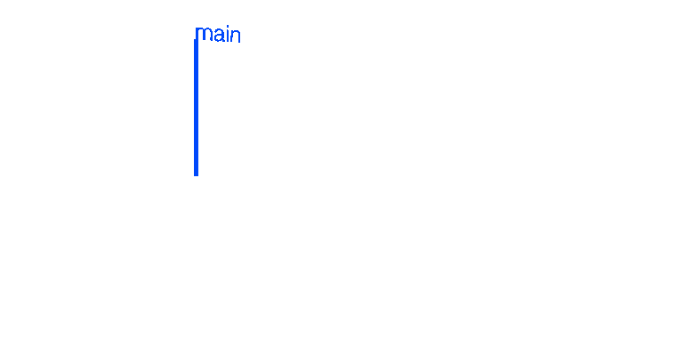
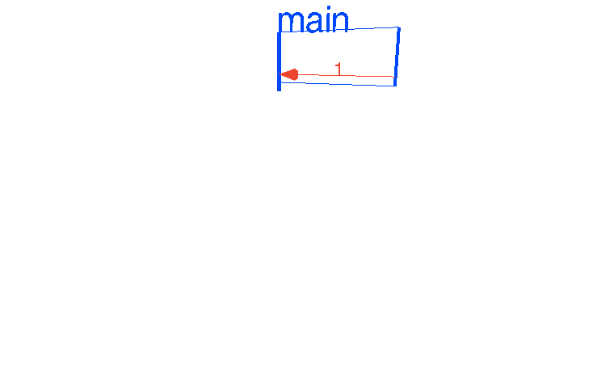

# Visualizing Concurrency in Go

original: <http://divan.github.io/posts/go_concurrency_visualize/>

by [divan](http://divan.github.io)

Posted on Jan 24,
2016

*If you prefer video over blog posts, here is my talk on this at GopherCon 
2016:* <https://www.youtube.com/watch?v=KyuFeiG3Y60>

One of the strongest sides of Go programming language is a built-in concurrency 
based on [Tony Hoare’s CSP][1] paper. Go is designed with concurrency in mind 
and allows us to build complex concurrent pipelines. But have you ever wondered 
- how various concurrency patterns look like?

[1]: https://en.wikipedia.org/wiki/Communicating_sequential_processes

Of course, you have. We’re all thinking mostly by visualization in one form or 
another. If I ask you something involving “numbers from 1 to 100” you will have 
your own image of the series in your head, even without realizing it. For 
example, I imagine it as a line going from me with numbers from 1 to 20, then it 
turns 90 degrees to the right and continues to the 1000+. I recall from very 
young period of my life that in our kindergarten there were numbers in a 
cloakroom, written along the wall, and number 20 was exactly at the corner. You 
probably have your own image of numbers. Another common example is the visual 
representation of the full year with four seasons - some people see it as a box, 
other - as a circle.

Anyway, I want to show you my attempt to visualize common concurrency patterns 
using Go and WebGL. It more or less represents the way I see concurrent programs 
in my head. Would be pretty interesting to hear how much it differs from images 
in your head. I especially would love to see how Rob Pike or Sameer Ajmani 
imagine concurrency. I bet I’d be quite interesting.

So, let’s start with the very basic “Hello, Concurrent World” example, to get 
ourselves familiar with the concept of my attempt.

### Hello, Concurrent world

The code is quite simple - single channel, single goroutine, one write, one 
read.

```go
package main

func main() {
    // create new channel of type int
    ch := make(chan int)

    // start new anonymous goroutine
    go func() {
        // send 42 to channel
        ch <- 42
    }()
    // read from channel
    <-ch
}
```



Here the blue lines represent goroutines running down through time. Thin blue 
lines connecting ‘main’ and ‘go \#19’ are marks for start and stop goroutine, 
revealing parent-children relation and, finally, red arrow shows us the send/
recv action. While it’s actually two separate actions, I try to animate as a 
single event “send from A to B”. The “\#19” in the goroutine name is the actual 
goroutine internal ID, obtained from runtime with a trick suggested by Scott 
Mansfield in [“Goroutine IDs”][2] article.

[2]: http://blog.sgmansfield.com/2015/12/goroutine-ids/

### Timers

In fact, you can build a simple timer with this approach - create a channel, 
start goroutine which writes to this channel after given duration and returns 
this channel to the caller of your func. The caller then blocks on reading from 
the channel for the exact amount of time.  Let’s run such timer 24 times and try 
to visualize it.

```go
package main

import "time"

func timer(d time.Duration) <-chan int {
    c := make(chan int)
    go func() {
        time.Sleep(d)
        c <- 1
    }()
    return c
}

func main() {
    for i := 0; i < 24; i++ {
        c := timer(1 * time.Second)
        <-c
    }
}
```



Pretty neat, right? Let’s move on.

### Ping-pong

This nice concurrency example was found in a great talk by googler Sameer Ajmani 
[“Advanced Go Concurrency Patterns”][3]. Of course, this pattern isn’t very 
advanced, but for those who only get themselves familiar with Go concurrency it 
may look quite fresh and interesting.

[3]: https://talks.golang.org/2013/advconc.slide#1

Here we have a channel as a table of the ping-pong game. The ball is an integer 
variable, and two goroutines-players that ‘hit’ the ball, increasing its value 
(hits counter).

```go
package main

import "time"

func main() {
    var Ball int
    table := make(chan int)
    go player(table)
    go player(table)

    table <- Ball
    time.Sleep(1 * time.Second)
    <-table
}

func player(table chan int) {
    for {
        ball := <-table
        ball++
        time.Sleep(100 * time.Millisecond)
        table <- ball
    }
}
```

 

At this point I’d suggest you to click that [link above](/demos/pingpong/) to 
the interactive WebGL animation (Ctrl/Cmd-Click to open it in a new tab) and 
play around with interactively. You can slowdown animation, speedup and see it 
in different angles.

Now, let’s run three players instead of two.

``` 
go player(table)
go player(table)
go player(table)
```

 

We can see here that each player takes its turn sequentially and you may wonder 
why is it so. Why we see this strict order in goroutines receiving the ball?

The answer is because Go runtime holds waiting [FIFO queue for receivers][4] 
(goroutines ready to receive on the particular channel), and in our case every 
player gets ready just after he passed the ball on the table.  Let’s check it 
with more complex example and run 100 table tennis players.

[4]: https://github.com/golang/go/blob/master/src/runtime/chan.go#L34

```go
for i := 0; i < 100; i++ {
    go player(table)
}
```

 

The FIFO order is now obvious, isn’t it? We can spawn a million goroutines 
(they’re cheap), but for our goal that would be overkill. Let’s see something 
different to play with. For example, common messaging patterns.

### Fan-In

One of the popular patterns in the concurrent world is a so called *fan-in* 
pattern. It’s the opposite of the *fan-out* pattern, which we will cover later.
To be short, fan-in is a function reading from the multiple inputs and 
multiplexing all into the single channel.

For example:

```go
package main

import (
    "fmt"
    "time"
)

func producer(ch chan int, d time.Duration) {
    var i int
    for {
        ch <- i
        i++
        time.Sleep(d)
    }
}

func reader(out chan int) {
    for x := range out {
        fmt.Println(x)
    }
}

func main() {
    ch := make(chan int)
    out := make(chan int)
    go producer(ch, 100*time.Millisecond)
    go producer(ch, 250*time.Millisecond)
    go reader(out)
    for i := range ch {
        out <- i
    }
}
```

 

As we can see, first *producer* generates values each 100 milliseconds, and 
second one - each 250 milliseconds, but *reader* receives values from both 
producers immediately. Effectively, multiplexing happens in a range loop in 
*main*.

### Workers

The opposite pattern to *fan-in* is a *fan-out* or *workers* pattern.  Multiple 
goroutines can read from a single channel, distributing an amount of work 
between CPU cores, hence the *workers* name. In Go, this pattern is easy to 
implement - just start a number of goroutines with channel as parameter, and 
just send values to that channel - distributing and multiplexing will be done by 
Go runtime, automagically :)

```go
package main

import (
    "fmt"
    "sync"
    "time"
)

func worker(tasksCh <-chan int, wg *sync.WaitGroup) {
    defer wg.Done()
    for {
        task, ok := <-tasksCh
        if !ok {
            return
        }
        d := time.Duration(task) * time.Millisecond
        time.Sleep(d)
        fmt.Println("processing task", task)
    }
}

func pool(wg *sync.WaitGroup, workers, tasks int) {
    tasksCh := make(chan int)

    for i := 0; i < workers; i++ {
        go worker(tasksCh, wg)
    }

    for i := 0; i < tasks; i++ {
        tasksCh <- i
    }

    close(tasksCh)
}

func main() {
    var wg sync.WaitGroup
    wg.Add(36)
    go pool(&wg, 36, 50)
    wg.Wait()
}
```

 

One thing worth to note here: the parallelism. As you can see, all goroutines 
‘run’ in parallel, waiting for channel to give them ‘work’ to do. Given the 
animation above, it’s easy to spot that goroutines receive their work almost 
immediately one after another. Unfortunately, this animation doesn’t show in 
color where goroutine really does work or just waits for input, but this exact 
animation was recorded with GOMAXPROCS=4, so only 4 goroutines effectively run 
in parallel. We will get to this subject shortly.

For now, let’s do something more complex, and start workers that have their own 
workers (subworkers).

```go
package main

import (
    "fmt"
    "sync"
    "time"
)

const (
    WORKERS    = 5
    SUBWORKERS = 3
    TASKS      = 20
    SUBTASKS   = 10
)

func subworker(subtasks chan int) {
    for {
        task, ok := <-subtasks
        if !ok {
            return
        }
        time.Sleep(time.Duration(task) * time.Millisecond)
        fmt.Println(task)
    }
}

func worker(tasks <-chan int, wg *sync.WaitGroup) {
    defer wg.Done()
    for {
        task, ok := <-tasks
        if !ok {
            return
        }

        subtasks := make(chan int)
        for i := 0; i < SUBWORKERS; i++ {
            go subworker(subtasks)
        }
        for i := 0; i < SUBTASKS; i++ {
            task1 := task * i
            subtasks <- task1
        }
        close(subtasks)
    }
}

func main() {
    var wg sync.WaitGroup
    wg.Add(WORKERS)
    tasks := make(chan int)

    for i := 0; i < WORKERS; i++ {
        go worker(tasks, &wg)
    }

    for i := 0; i < TASKS; i++ {
        tasks <- i
    }

    close(tasks)
    wg.Wait()
}
```

 

Nice. Of course, we can set number of workers and subworkers to much higher 
values, but I tried to make animations clear and understandable.

There are even cooler fan-out patterns do exist, like the dynamic amount of 
workers/subworkers, with sending channels over channels, but the idea of fan-out 
should be clear for now.

### Servers

Next common pattern is similar to fan-out, but with goroutines spawned for the 
short period of time, just to accomplish some task. It’s typically used for 
implementing servers - create a listener, run accept() in a loop and start 
goroutine for each accepted connection.  It’s very expressive and allows to 
implement server handlers as simple as possible. Take a look at this simple 
example:

```go
package main

import "net"

func handler(c net.Conn) {
    c.Write([]byte("ok"))
    c.Close()
}

func main() {
    l, err := net.Listen("tcp", ":5000")
    if err != nil {
        panic(err)
    }
    for {
        c, err := l.Accept()
        if err != nil {
            continue
        }
        go handler(c)
    }
}
```

 

It’s not very interesting - it seems there is nothing happens in terms of 
concurrency. Of course, under the hood there is a ton of complexity, which is 
deliberately hidden from us.  [“Simplicity is complicated”][5].

[5]: https://www.youtube.com/watch?v=rFejpH_tAHM

But let’s go back to concurrency and add some interaction to our server.  Let’s 
say, each handler wants to write asynchronously to the logger.  Logger itself, 
in our example, is a separate goroutine which does the job.

```go
package main

import (
    "fmt"
    "net"
    "time"
)

func handler(c net.Conn, ch chan string) {
    ch <- c.RemoteAddr().String()
    c.Write([]byte("ok"))
    c.Close()
}

func logger(ch chan string) {
    for {
        fmt.Println(<-ch)
    }
}

func server(l net.Listener, ch chan string) {
    for {
        c, err := l.Accept()
        if err != nil {
            continue
        }
        go handler(c, ch)
    }
}

func main() {
    l, err := net.Listen("tcp", ":5000")
    if err != nil {
        panic(err)
    }
    ch := make(chan string)
    go logger(ch)
    go server(l, ch)
    time.Sleep(10 * time.Second)
}
```

 

Quite demonstrative, isn’t it? But it’s easy to see that our *logger* goroutine 
can quickly become a bottleneck if the number of requests increase and logging 
action take some time (preparing and encoding data, for example). We can use an 
already known fan-out pattern. Let’s do it.

### Server + Worker

Server with worker example is a bit advanced version of the logger. It not only 
does some work but sends the result of its work back to the pool using *results* 
channel. Not a big deal, but it extends our logger example to something more 
practical.

Let’s see the code and animation:

```go
package main

import (
    "net"
    "time"
)

func handler(c net.Conn, ch chan string) {
    addr := c.RemoteAddr().String()
    ch <- addr
    time.Sleep(100 * time.Millisecond)
    c.Write([]byte("ok"))
    c.Close()
}

func logger(wch chan int, results chan int) {
    for {
        data := <-wch
        data++
        results <- data
    }
}

func parse(results chan int) {
    for {
        <-results
    }
}

func pool(ch chan string, n int) {
    wch := make(chan int)
    results := make(chan int)
    for i := 0; i < n; i++ {
        go logger(wch, results)
    }
    go parse(results)
    for {
        addr := <-ch
        l := len(addr)
        wch <- l
    }
}

func server(l net.Listener, ch chan string) {
    for {
        c, err := l.Accept()
        if err != nil {
            continue
        }
        go handler(c, ch)
    }
}

func main() {
    l, err := net.Listen("tcp", ":5000")
    if err != nil {
        panic(err)
    }
    ch := make(chan string)
    go pool(ch, 4)
    go server(l, ch)
    time.Sleep(10 * time.Second)
}
```

 

We distributed work between 4 goroutines, effectively improving the throughput 
of the logger, but from this animation, we can see that logger still may be the 
source of problems. Thousands of connections converge in a single channel before 
being distributed and it may result in a logger being bottleneck again.  But, of 
course, it will happen on much higher loads.

### Concurrent Prime Sieve

Enough fan-in/fan-out fun. Let’s see more sophisticated concurrency algorithms. 
One of my favorite examples is a Concurrent Prime Sieve, found in [“Go 
Concurrency Patterns”][6] talk.  Prime Sieve, or [Sieve of Eratosthenes][7] is 
an ancient algorithm for finding prime number up to the given limit. It works by 
eliminating multiples of all primes in a sequential manner.  Naive algorithm is 
not really efficient, especially on multicore machines.

[6]: https://talks.golang.org/2012/concurrency.slide
[7]: https://en.wikipedia.org/wiki/Sieve_of_Eratosthenes

The concurrent variant of this algorithm uses goroutines for filtering numbers - 
one goroutine per every prime discovered, and channels for sending numbers from 
the generator to filters. When prime is found, it’s being sent via the channel 
to the *main* for output. Of course, this algorithm is also not very efficient, 
especially if you want to find large primes and look for the lowest Big O 
complexity, but I find it extremely elegant.

```go
// A concurrent prime sieve
package main

import "fmt"

// Send the sequence 2, 3, 4, ... to channel 'ch'.
func Generate(ch chan<- int) {
    for i := 2; ; i++ {
        ch <- i // Send 'i' to channel 'ch'.
    }
}

// Copy the values from channel 'in' to channel 'out',
// removing those divisible by 'prime'.
func Filter(in <-chan int, out chan<- int, prime int) {
    for {
        i := <-in // Receive value from 'in'.
        if i%prime != 0 {
            out <- i // Send 'i' to 'out'.
        }
    }
}

// The prime sieve: Daisy-chain Filter processes.
func main() {
    ch := make(chan int) // Create a new channel.
    go Generate(ch)      // Launch Generate goroutine.
    for i := 0; i < 10; i++ {
        prime := <-ch
        fmt.Println(prime)
        ch1 := make(chan int)
        go Filter(ch, ch1, prime)
        ch = ch1
    }
}
```

 

Feel free to play with this animation in interactive mode. I like how 
illustrative it is - it really can help understand this algorithm better. The 
*generate* goroutine emits every integer number, starting from 2, and each new 
goroutine filters out only specific prime multiples - 2, 3, 5, 7…, sending first 
found prime to *main*. If you rotate it to see from the top, you’ll see all 
numbers being sent from goroutines to main are prime numbers.  Beautiful 
algorithm, especially in 3D.

### GOMAXPROCS

Now, let’s go back to our workers example. Remember, I told that it was run with 
GOMAXPROCS=4? That’s because all these animations are not art work, they are 
real traces of real programs.

Let’s refresh our memory on what
[GOMAXPROCS](https://golang.org/pkg/runtime/#GOMAXPROCS) is.

> GOMAXPROCS sets the maximum number of CPUs that can be executing 
> simultaneously.

CPU means logical CPU, of course. I modified workers example a bit to make a 
real work (not just sleep) and use real CPU time. Then I ran the code without 
any modification except setting different GOMAXPROCS value.  The Linux box had 2 
CPUs with 12 cores each, resulting in 24 cores.

So, the first run demonstrates the program running on 1 core, and second - using 
the power of all 24 cores availiable.

[WebGL animation - 1](/demos/gomaxprocs1/) | [WebGL animation -
24](/demos/gomaxprocs24/) 
 

The time speed in these animations are different (I wanted all animations to fit 
the same time/height), so the difference is obvious. With GOMAXPROCS=1, next 
worker start real work only after previous has finish it’s work. With 
GOMAXPROCS=24 the speedup is huge, and overhead for multiplexing is negligible.

It’s important to understand, though, that increasing GOMAXPROCS not always 
boosts performance, and there cases when it actually makes it worse.

### Goroutines leak

What else we can demonstrate from concurrent things in Go? The one thing that 
comes to my mind is a goroutines leak. A leak can happen, for example, if you 
[start goroutine but it falls out of scope][8]. Or you simply forget to add 
finish condition, and run a for {} loop.

[8]: http://openmymind.net/Leaking-Goroutines/
[9]: https://github.com/divan/expvarmon

First time I’ve encountered goroutine leak in my code, the scary image appeared 
in my head and I wrote [expvarmon][9] next weekend. And now I can visualize that 
scary image with WebGL.


Take a look:

 

I feel pain even simply by looking at this :) All those lines are wasted 
resources and a ticking bomb for your program.

### Parallelism is not Concurrency

The last thing I want to illustrate is a difference between parallelism and 
concurrency. This topic is [well][10] [covered][11], and there is a [great talk 
by Rob Pike][12] on the subject. One of the \#mustwatch videos, really.

[10]: https://existentialtype.wordpress.com/2011/03/17/parallelism-is-not-concurrency/
[11]: https://ghcmutterings.wordpress.com/2009/10/06/parallelism-concurrency/
[12]: https://www.youtube.com/watch?v=cN_DpYBzKso

To be short,

> Parallelism is simply running things in parallel.
> 
> Concurrency is a way to structure your program.

Thus, the concurrent program may or may not be parallel, these concepts are 
somehow orthogonal. We have seen this earlier in a demonstration of GOMAXPROCS 
setting effects.

I can repeat all those linked articles and talks, but a picture is worth a 
thousand words. What I can do here is to visualize the difference. So, this is 
parallelism. Many things running in parallel.


And this is also parallelism:


But this is concurrency:


And this:


And this is also concurrency:


### How it was made

To create these animations, I wrote two programs: *gotracer* and *gothree.js* 
library. First, gotracer does the following:

  - parse AST tree of Go program and insert special commands with output
    on concurrency related events - start/stop goroutine, create a
    channel, send/receive to/from a channel.
  - run generated program
  - analyze this special output and produce JSON with the description of
    events and timestamps.

Example of the resulting JSON: 

Next, gothree.js uses the power of an amazing [Three.js][13] library to draw 3D 
lines and objects using WebGL. Little wrapper to fit into single html page - and 
there it is.

[13]: http://threejs.org/
[14]: https://golang.org/cmd/trace/
[15]: https://github.com/divan/gotrace

This approach, though, is super limited. I have to accurately choose examples, 
rename channels and goroutines to make more or less complex code to produce a 
correct trace. With this approach, there is no easy way to correllate channels 
between goroutines if they have different names. Not to mention channels sent 
over channels of type chan. There are also huge issues with timing - output to 
stdout can take more time than sending value, so in some cases I had to place 
time.Sleep(some amount of milliseconds) to get proper animation.

Basically, that is a reason why I’m not open-sourcing the code yet. I’m playing 
with Dmitry Vyukov’s [execution tracer][14], it seems to provide good level of 
details of events, but do not contain info on which values are being sent. Maybe 
there are better ways to achieve the desired goal. Write me in twiter or in 
comments here, if you have ideas. It would be super great to extend this two-
weekends tool to be a real debugging/tracing instrument suitable for any Go 
program.

I also would be happy to visualize more interesting concurrent algorithms and 
patterns not listed here. Feel free to write ones in the comments.

Happy coding\!

UPD: This tool is available at [github.com/divan/gotrace][15] and using Go 
Execution Tracer and patched runtime to generate trace.

Also, I’m open for the new job, so if you’re interesting company/team, have 
challenging problems to solve, use Go, open for remote (or you’re in Barcelona) 
and hiring, let me know :)
