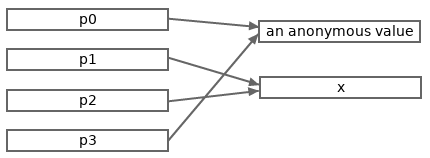

[Pointers In Go][1]
===================

[1]: https://go101.org/article/pointer.html

Although Go absorbs many features from all kinds of other languages, Go is 
mainly viewed as a C family language. One evidence is Go also supports pointers. 
Go pointers and C pointers are much similar in many aspects, but there are also 
some differences between Go pointers and C pointers. This article will list all 
kinds of concepts and details related to pointers in Go.

### Memory Addresses

A memory address means an offset (number of bytes) from the start point of the 
whole memory managed by a system (generally, operation system).

Generally, a memory address is stored as an unsigned native (integer) word. The 
size of a native word is 4 (bytes) on 32-bit architectures and 8 (bytes) on 64-
bit architectures. So the theoretical maximum memory space size is 2<sup>32</
sup> bytes, a.k.a. 4GB (1GB == 2<sup>30</sup> bytes), on 32-bit architectures, 
and is 2<sup>34</sup>GB (16 exabytes) on 64-bit architectures.

Memory addresses are often represented with hex integer literals, such as 
`0x1234CDEF`.

### Value Addresses

The address of a value means the start address of the memory segment occupied by 
the [direct part][2] of the value.

[2]: value-part.html

### What Are Pointers?

**Pointer is one kind of type in Go. A pointer is a value of some pointer type.** A 
pointer value can storage a memory address. In fact, we often call a memory 
address as a pointer, and vice versa.

Generally, the stored memory address in a pointer is the address of another 
value. Unlike C language, for safety reason, there are some restrictions made 
for Go pointers. Please read the following sections for details.

### Go Pointer Types And Values

Same as C langauge, an unnamed pointer type can be represented with `*T`, where 
`T` can be an arbitrary type. Type `T` is called the base type of pointer type 
`*T`.

We can declare named pointer types, but generally this is not recommended. 
Unnamed pointer types have better readabilities than named ones.

If the [underlying type][3] of a defined pointer type is `*T`, then the base 
type of the defined pointer type is `T`.

[3]: type-system-overview.html#underlying-type

Two non-defined pointer types with the same base type are the same type.

Example:

```go
*int  // A unnamed pointer type whose base type is int.
**int // A multi-level unnamed pointer type whose base type is *int.

type Ptr *int // Ptr is a defined pointer type whose base type is int.
type PP *Ptr  // PP is a defined pointer type whose base type is Ptr.
```

Zero values of any pointer types are represented with the predeclared `nil`. No 
addresses are stored in nil pointer values.

A value of a pointer type whose base type is `T` can only store the addresses of 
values of type `T`.

### About The Word "Reference"

In Go 101, the word "reference" indicates a relation. For example, if a pointer 
value stores the address of another value, then we can say the pointer value 
(directly) references the other value, and the other value has at least one 
reference. The uses of the word "reference" in Go 101 are consistent with Go 
specification.

When a pointer value references another value, we also often say the pointer 
value points to the other value.

### How To Get A Pointer Value And What Are Addressable Values?

There are two ways to get a non-nil pointer value.

1.  The built-in `new` function can be used to allocate memory for a value of 
    any type. `new(T)` will allocate memory for a `T` value (an anonymous 
    variable) and return the address of the `T` value. The allocated value is a 
    zero value of type `T`. The returned address is viewed as a pointer value of 
    type `*T`.

2.  We can also take the addresses of values which are addressable in Go. For an 
    addressable value `t` of type `T`, we can use the expression `&t` to take 
    the address of `t`, where `&` is the operator to take value addresses. The 
    type of `&t` is viewed as `*T`.

Now we just need know that **all variables are addressable.** **Constants, 
function calls and explicit conversion results are all unaddressable**. We will 
learn other addressable and unaddressable values from other articles later. If 
you have already been familar with Go, you can read [this summary][4] to get the 
lists of addressable and unaddressable values in Go.

The next section will show an example on how to get pointer values.

[4]: summaries.html#not-addressable

### Pointer Dereference

Given a pointer value `p` of type `Tp`, how to get the value at the address 
stored in the pointer? Just use the expression `*p`, where `*` is called 
dereference operator. `*p` is call the dereference of poiner `p`. Pointer 
dereference is the inverse process of address taking. The result of `*p` is a 
value of the base type of `Tp`.

Dereferencing a nil pointer causes a runtime panic.

The following program shows some address taking and pointer dereference 
examples:

```go
package main

import "fmt"

func main() {
    p0 := new(int)   // p0 points to a zero int value.
    fmt.Println(p0)  // (a hex address string)
    fmt.Println(*p0) // 0

    // x is a copy of the value at the address stored in p0.
    x := *p0
    p1, p2 := &x, &x      // both take address of x.
                          // x, *p1 and *p2 represent the same value.
    fmt.Println(p1 == p2) // true
    fmt.Println(p0 == p1) // false
    p3 := &*p0            // <=> p3 := &(*p0)
                          // Now, p3 and p0 store the same address.
    fmt.Println(p0 == p3) // true
    *p0, *p1 = 123, 789
    fmt.Println(*p2, x, *p3) // 789 789 123

    fmt.Printf("%T, %T \n", *p0, x) // int, int
    fmt.Printf("%T, %T \n", p0, p1) // *int, *int
}
```

The following picture depicts the relations of the values used in the above 
program.



### Why Do We Need Pointers?

Let's view an example firstly.

```go
package main

import "fmt"

func double(x int) {
    x += x
}

func main() {
    var a = 3
    double(a)
    fmt.Println(a) // 3
}
```

The `double` function in the above example is expected to modify the input 
argument by doubling it. However, it fails. Why? Because all value assignments, 
including function argument passing, are value copying in Go. What the `double` 
function modified is a copy (`x`) of variable `a` but not variable `a`.

One solution to fix the above `double` function is let it return the 
modification result. This solution doesn't always work for all scenarios. The 
following example shows another solution, by using a pointer parameter.

```go
package main

import "fmt"

func double(x *int) {
    *x += *x
    x = nil // This line is just for explanation purpose.
}

func main() {
    var a = 3
    double(&a)
    fmt.Println(a) // 6
    p := &a
    double(p)
    fmt.Println(a, p == nil) // 12 false
}
```

We can find that, by changing the parameter to a pointer type, the passed 
pointer argument `&a` and its copy `x` used in the function body both reference 
the same value, so the modification on `*x` is equivalent to a modification on 
`*p`, a.k.a., variable `a`. In other words, the modification in the `double` 
function body can be reflected out of the function now.

Surely, the modification of the copy of the passed pointer argument itself still 
can't be reflected on the passed pointer argument. After the second `double` 
function call, the local pointer `p` doesn't get modified to `nil`.

In short, pointers provide indirect ways to access some values so that these 
values can be avoided being copied. Many languages have not the pointer concept, 
however, pointers are just hidden under other concepts in those languages.

### Return Pointers Of Local Variables Is Safe In Go

Unlike C language, Go is a language supporting garbage collection, so return the 
address of a local variable is absolutely safe in Go.

```go
func newInt() *int {
    a := 3
    return &a
}
```

### Restrictions On Pointers In Go

For safety reasons, Go makes some restrictions to pointers (comparing to 
pointers in C language). By applying these restrictions, Go keeps the benefits 
of pointers, and avoids the dangerousness of pointers at the same time.

#### Go Pointer Values Don't Support Arithmetic Operations

In Go, pointers can't do arithmetic operations. For a pointer `p`, `p++` and 
`p-2` are both illegal.

If `p` is a pointer to a numeric value, compilers will view `*p++` is a legal 
statement and treat it as `(*p)++`. In other word, the precedences of the 
address-taken operator `&` and the pointer dereference operator `*` are both 
higher than the increment operator `++` and decrement operator `--`.

Example:

```go
package main

import "fmt"

func main() {
    a := int64(5)
    p := &a

    // The following two lines don't compile.
    /*
    p++
    p = (&a) + 8
    */

    *p++
    fmt.Println(*p, a)   // 6 6
    fmt.Println(p == &a) // true
    
    *&a++
    *&*&a++
    **&p++
    *&*p++
    fmt.Println(*p, a) // 10 10
}
```

#### A Pointer Value Can't Be Converted To An Arbitrary Pointer Type

In Go, a pointer value of pointer type `T1` can be directly and explicitly 
converted to another pointer type `T2` only if either of the following two 
conditions is get satisfied.

1.  The underlying types of type `T1` and `T2` are identical (ignoring struct 
    tags), in particular if either `T1` and `T2` is a [non-defined][5] type and 
    they underlying types are identical (considering struct tags), then the 
    conversion can be implicit. (Struct types and values will be explained in 
    [the next article][6].)

2.  Type `T1` and `T2` are both non-defined pointer types and the underlying 
    types of their base types are identical (ignoring struct tags).

[5]: type-system-overview.html#non-defined-type
[6]: struct.html

For example, for the below shown pointer types:

```go
type MyInt int64
type Ta    *int64
type Tb    *MyInt
```

the following facts exist:

1.  values of type `*int64` can be implicitly converted to type `Ta`, and vice 
    versa, for their underlying types are both `*int64`.

2.  values of type `*MyInt` can be implicitly converted to type `Tb`, and vice 
    versa, for their underlying types are both `*MyInt`.

3.  values of type `*MyInt` can be explicitly converted to type `*int64`, and 
    vice versa, for they are both non-defined and the underlying types of their 
    base types are both `int64`.

4.  values of type `Ta` can't be directly converted to type `Tb`, even if 
    explicitly. However, by the just listed first three facts, a value `pa` of 
    type `Ta` can be indirectly converted to type `Tb` by nesting three explicit 
    conversions, `Tb((*MyInt)((*int64)(pa)))`.

None values of these pointer types can be converted to type `*uint64`, in any 
safe ways.

#### A Pointer Value Can't Be Compared With Values Of An Arbitrary Pointer Type

In Go, pointers can be compared with `==` and `!=` operators. Two Go
pointer values can only be compared if either of the following three
conditions are satisified.

1.  The types of the two Go pointers are identical.
2.  One pointer value can be implicitly converted to the pointer type of
    the other. In other words, the underlying types of the two types
    must be identical and either of the two types of the two Go pointers
    must be an undefined type.
3.  One and only one of the two pointers is represented with the bare
    (untyped) `nil` identifier.

Example:

``` line-numbers
package main

func main() {
    type MyInt int64
    type Ta    *int64
    type Tb    *MyInt

    // 4 nil pointers of different types.
    var pa0 Ta
    var pa1 *int64
    var pb0 Tb
    var pb1 *MyInt

    // The following 6 lines compile okay.
    // The comparison results are all true.
    _ = pa0 == pa1
    _ = pb0 == pb1
    _ = pa0 == nil
    _ = pa1 == nil
    _ = pb0 == nil
    _ = pb1 == nil

    // None of the following 3 lines compile.
    /*
    _ = pa0 == pb0
    _ = pa1 == pb1
    _ = pa0 == Tb(nil)
    */
}
```

</div>

#### A Pointer Value Can't Be Assigned To Pointer Values Of Other Pointer Types

The conditions to assign a pointer value to another pointer value are
the same as the conditions to compare a pointer value to another pointer
value, which are listed above.

### It's Possible To Break The Go Pointer Restrictions

As the start of this article has mentioned, the mechanisms
(specifically, the `unsafe.Pointer` type) provided by [the `unsafe`
standard package](unsafe.html) can be used to break the restrictions
made for pointers in Go. The `unsafe.Pointer` type is like the `void*`
in C. However, generally, the unsafe ways are not recommended to be used
in general Go programming.

-----

The ***Go 101*** project is hosted on both [Github][20] and [Gitlab][21]). 
Welcome to improve ***Go 101*** articles by submitting corrections for all kinds 
of mistakes, such as typos, grammar errors, wording inaccuracies, description 
flaws, code bugs and broken links.

Support Go 101 by playing [Tapir's games][22].

[20]: https://github.com/go101/go101
[21]: https://gitlab.com/Go101/go101
[22]: https://www.tapirgames.com
